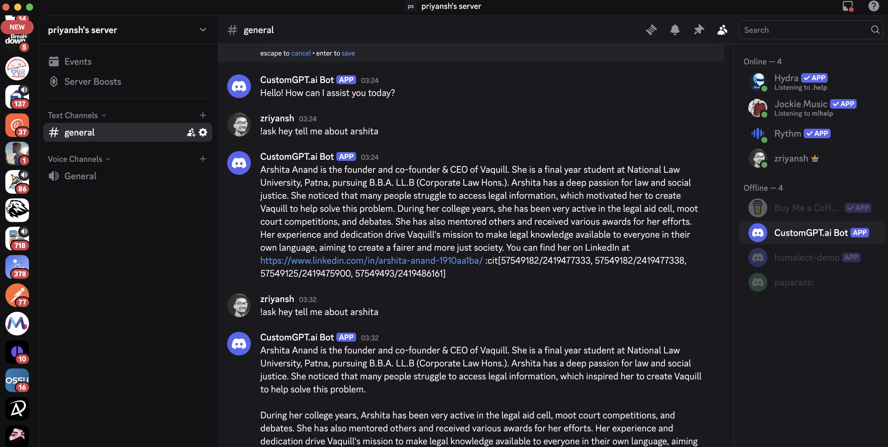

# CustomGPT Discord Bot

A Discord bot that integrates with CustomGPT's API to answer questions using your agent's knowledge base.



## Features

- 🤖 **AI-Powered Responses**: Uses CustomGPT's API to provide intelligent answers
- 💬 **Conversation Memory**: Maintains context within Discord channels
- 🚀 **Starter Questions**: Interactive buttons for common questions
- 📚 **Source Citations**: Shows sources for answers when available
- ⏱️ **Rate Limiting**: Prevents abuse with configurable limits
- 🔒 **Security**: Channel and role-based access control
- 📄 **Pagination**: Handles long responses elegantly
- ⚡ **Real-time**: Typing indicators and responsive UI

## Setup Instructions

### 1. Prerequisites

- Python 3.8 or higher
- Discord Bot Token ([Create a bot here](https://discord.com/developers/applications))
- CustomGPT API Key and Agent ID ([Get from CustomGPT](https://app.customgpt.ai))

### 2. Installation

```bash
# Clone the repository
git clone <your-repo-url>
cd discord

# Install dependencies
pip install -r requirements.txt

# Copy environment variables
cp .env.example .env
```

### 3. Configuration

Edit `.env` file with your credentials:

```env
# Required
DISCORD_BOT_TOKEN=your_discord_bot_token
CUSTOMGPT_API_KEY=your_customgpt_api_key
CUSTOMGPT_AGENT_ID=your_agent_id

# Optional (defaults shown)
DISCORD_COMMAND_PREFIX=!
RATE_LIMIT_PER_USER=10
RATE_LIMIT_PER_CHANNEL=30
```

### 4. Discord Bot Setup

1. Go to [Discord Developer Portal](https://discord.com/developers/applications)
2. Create a New Application
3. Go to Bot section and create a bot
4. Copy the bot token
5. **IMPORTANT**: Enable Privileged Gateway Intents:
   - Scroll down to "Privileged Gateway Intents"
   - Toggle ON the "MESSAGE CONTENT INTENT" (Required for the bot to read messages)
   - Click "Save Changes"
6. Go to OAuth2 > URL Generator
7. Select scopes: `bot`, `applications.commands`
8. Select permissions: `Send Messages`, `Embed Links`, `Read Message History`, `Use Slash Commands`
9. Use the generated URL to invite the bot to your server

### 5. Running Locally

```bash
python bot.py
```

## Deployment Options

### Option 1: Railway (Recommended - Free Tier Available)

1. Install Railway CLI:
```bash
npm install -g @railway/cli
```

2. Deploy:
```bash
railway login
railway init
railway up
```

3. Set environment variables in Railway dashboard

### Option 2: Fly.io (Free Tier Available)

1. Install Fly CLI:
```bash
curl -L https://fly.io/install.sh | sh
```

2. Deploy:
```bash
flyctl launch
flyctl deploy
flyctl secrets set DISCORD_BOT_TOKEN=xxx CUSTOMGPT_API_KEY=xxx CUSTOMGPT_AGENT_ID=xxx
```

### Option 3: Replit (Free with Limitations)

1. Create new Python repl on [Replit](https://replit.com)
2. Upload all files
3. Set environment variables in Secrets tab
4. Run the bot
5. Use [UptimeRobot](https://uptimerobot.com) to keep it alive

### Option 4: Heroku (No longer free)

See `heroku/` directory for Heroku-specific files.

### Option 5: VPS (Self-hosted)

1. Use systemd service (see `discord.service` file)
2. Or use Docker (see `Dockerfile`)

## Bot Commands

- `!ask [question]` - Ask a question to the CustomGPT agent
- `!help` - Show interactive help menu
- `!info` - Display agent information
- `!starters` - Show starter questions with buttons
- `!reset` - Reset conversation in current channel

## Advanced Configuration

### Rate Limiting

Configure in `.env`:
- `RATE_LIMIT_PER_USER`: Queries per minute per user
- `RATE_LIMIT_PER_CHANNEL`: Queries per minute per channel
- `REDIS_URL`: Optional Redis URL for distributed rate limiting

### Access Control

Configure in `.env`:
- `ALLOWED_CHANNELS`: Comma-separated channel IDs
- `ALLOWED_ROLES`: Comma-separated role IDs

### Redis Setup (Optional)

For distributed rate limiting across multiple bot instances:

1. Free Redis: [Redis Cloud](https://redis.com/try-free/) (30MB free)
2. Set `REDIS_URL` in `.env`

## Monitoring

- Check logs for errors
- Monitor rate limit hits
- Track API usage in CustomGPT dashboard

## Troubleshooting

### Bot not responding
- Check bot token is correct
- Verify bot has proper permissions
- Check allowed channels/roles configuration

### PrivilegedIntentsRequired Error
- Go to Discord Developer Portal
- Select your application > Bot section
- Enable "MESSAGE CONTENT INTENT" under Privileged Gateway Intents
- Save changes and restart the bot

### API errors
- Verify CustomGPT API key and Agent ID
- Check API rate limits
- Ensure agent is active

### Rate limiting issues
- Adjust limits in `.env`
- Consider using Redis for better rate limiting

## Security Best Practices

1. Never commit `.env` file
2. Use environment variables in production
3. Regularly rotate API keys
4. Monitor for unusual activity
5. Set appropriate rate limits
6. Use channel/role restrictions

## Resources

### CustomGPT Links
- **[CustomGPT Landing Page](https://customgpt.ai)**
- **[Live Demo](https://app.customgpt.ai/agents?demo=chat)**
- **[CustomGPT Starter Kit](https://github.com/Poll-The-People/customgpt-starter-kit)**
- **[CustomGPT Integrations](https://github.com/Poll-The-People/customgpt-integrations)**
- **[API Documentation](https://docs.customgpt.ai/api-reference)**
- **[Postman Collection](https://www.postman.com/customgpt/customgpt/overview)**
- **[MCP Documentation](https://docs.customgpt.ai/model-content-protocol)**
- **[Office Hours](https://calendly.com/pollthepeople/office-hours)**
- **[YouTube Channel](https://www.youtube.com/channel/UC6HOk7Z9OwVPNYiC7SKMJ6g)**

### Video Tutorial
- **[Discord Bot Setup Video](https://youtu.be/mhqIJZ8fFAk)**

### Platform Documentation
- Discord.py Documentation: [discordpy.readthedocs.io](https://discordpy.readthedocs.io)

## Support

For issues related to:
- Discord Bot: Check Discord.py documentation
- CustomGPT API: Check the resources above or contact CustomGPT support
- This integration: Open an issue on GitHub