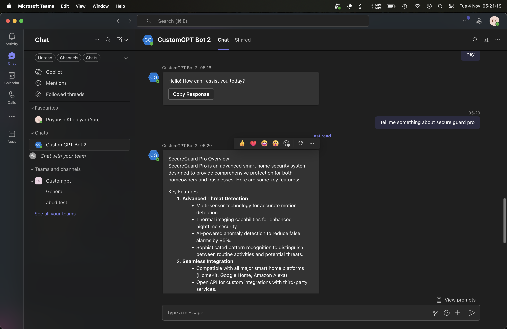
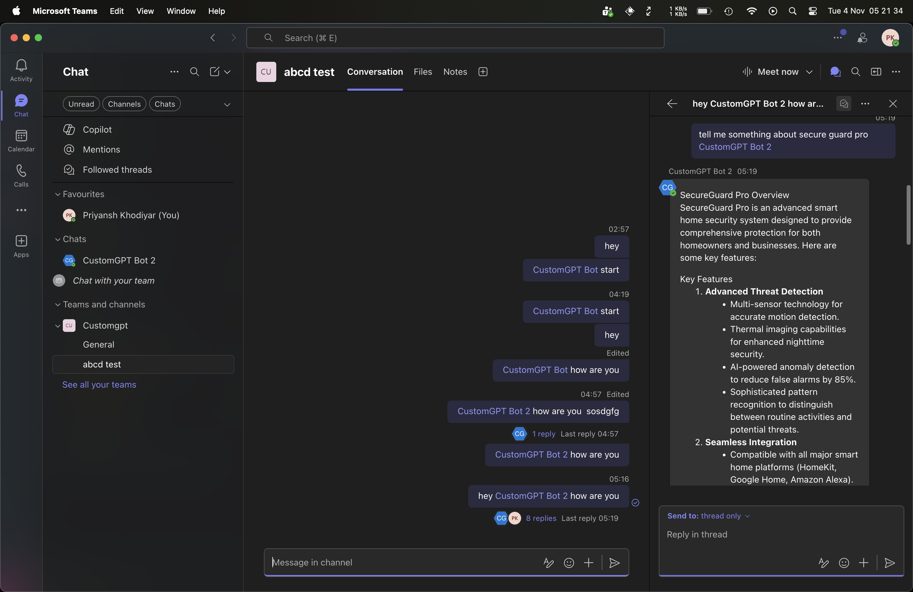

# CustomGPT Microsoft Teams Bot - Complete Guide

A production-ready Microsoft Teams bot that integrates with CustomGPT.ai API to bring your AI-powered knowledge base directly into Teams conversations.

Get you [CustomGPT.ai RAG API key here](https://app.customgpt.ai/register?utm_source=github_integrations), needed to use this integration. 





> **Quick Links**: [Prerequisites](#prerequisites) | [Getting Credentials](#getting-credentials) | [Setup](#quick-setup) | [Deployment](#deployment) | [Confluence](#confluence-integration) | [Troubleshooting](#troubleshooting)

---

## Table of Contents

1. [Features](#features)
2. [Prerequisites](#prerequisites)
3. [Getting Credentials](#getting-credentials)
4. [Quick Setup](#quick-setup)
5. [Configuration](#configuration)
6. [Deployment](#deployment)
7. [Confluence Integration](#confluence-integration)
8. [Usage](#usage)
9. [Troubleshooting](#troubleshooting)
10. [Support](#support)

---

## Features

### Core Capabilities
- 🤖 **Intelligent Q&A**: Access your CustomGPT knowledge base in Teams
- 💬 **Context-Aware Conversations**: Maintains conversation history
- 🧵 **Threading Support**: Seamless conversation threads
- 🎯 **@Mentions**: Responds to bot mentions in channels
- 🃏 **Adaptive Cards**: Rich, interactive UI elements
- ⚡ **Slash Commands**: `/help`, `/reset`, `/status`, `/search`

```
In personal chat: /help
In channel: @CustomGPT Bot 2 /help
```

### Enterprise Features
- 🔐 **Azure AD Authentication**: Secure enterprise authentication
- 📋 **Audit Logging**: Track all bot interactions
- 🛡️ **Access Control**: Tenant, channel, and user restrictions
- 🔄 **Rate Limiting**: Multi-tier (user/channel/tenant) protection
- 📊 **Analytics**: Application Insights integration
- 🌍 **Multi-tenant**: Works across organizations

### Optional Integrations
- 🔍 **Confluence**: Search Atlassian Confluence directly from Teams
- 📎 **File Attachments**: Process documents and images
- 💼 **Meeting Support**: Works in Teams meetings

---

## Prerequisites

| Requirement | Free Tier Available | Purpose |
|-------------|-------------------|---------|
| **[Azure Account](https://azure.microsoft.com/free/)** | ✅ Yes | Bot registration and hosting |
| **[CustomGPT.ai Account](https://app.customgpt.ai/register)** | ✅ Trial | AI knowledge base API |
| **Microsoft Teams Admin** | - | Install bot in Teams |
| **Python 3.8 - 3.11** | ✅ Yes | Local development |
| **Redis** (Optional) | ✅ Yes | Distributed rate limiting |

---

## Getting Credentials

You need 4 required credentials to run the bot. Follow these steps to get them.

### 1. Microsoft Teams Credentials (Azure Portal)

#### Step 1: Create App Registration

1. Go to [Azure Portal](https://portal.azure.com)
2. Search for **"Microsoft Entra ID"** → **"App registrations"** → **"+ New registration"**
3. Fill in:
   ```
   Name: customgpt-teams-bot
   Supported account types: Single tenant (recommended) or Multi-tenant
   Redirect URI: Leave blank
   ```
4. Click **"Register"**
5. **COPY THE APPLICATION (CLIENT) ID** - Save this as your `TEAMS_APP_ID`

#### Step 2: Create Client Secret

1. In the left menu, click **"Certificates & secrets"** → **"Client secrets"** tab
2. Click **"+ New client secret"**
3. Description: `Teams Bot Secret`, Expires: **24 months**
4. Click **"Add"**
5. **IMMEDIATELY COPY THE VALUE** - Save this as your `TEAMS_APP_PASSWORD`

⚠️ Copy the **Value**, NOT the "Secret ID". You can only see it once!

#### Step 3: Create Azure Bot Resource

1. [Azure Portal](https://portal.azure.com) → **"Create a resource"** → **"Azure Bot"**
2. Fill in:
   - Bot handle: `customgpt-teams-bot`
   - Pricing tier: **F0 (Free)**
   - Microsoft App ID: Enter the ID from Step 1
3. **"Review + Create"** → **"Create"**
4. You'll add the messaging endpoint later when you deploy

#### Step 4: Enable Teams Channel

1. Go to your Azure Bot → **"Channels"** → **"Microsoft Teams"** icon → **"Apply"**

✅ **Credentials ready:**
- `TEAMS_APP_ID` from Step 1
- `TEAMS_APP_PASSWORD` from Step 2

---

### 2. CustomGPT Credentials

#### Get CUSTOMGPT_API_KEY

1. Go to [CustomGPT Dashboard](https://app.customgpt.ai)
2. Sign in to your account
3. Click **profile icon** (top right) → **"API Settings"**
4. Click **"Generate API Key"** if you don't have one
5. Name it: `Teams Bot`
6. **Copy the API Key**

#### Get CUSTOMGPT_PROJECT_ID
Get this from `https://app.customgpt.ai/` > `Select your agent` > `Deploy` > "See top right section"

---

### 3. Optional: Confluence Credentials

Only needed if you want Confluence search integration.

#### For Confluence Cloud

1. **Base URL**: Your Confluence URL
   ```
   Example: https://your-company.atlassian.net
   ```

2. **Create API Token**:
   - Go to [Atlassian API Tokens](https://id.atlassian.com/manage-profile/security/api-tokens)
   - Click **"Create API token"**
   - Label: `Teams Bot`
   - **Copy the token**

3. **Username**: Your Atlassian email address

#### For Confluence Server/Data Center

1. **Base URL**: Your self-hosted URL
   ```
   Example: https://confluence.yourcompany.com
   ```

2. **Create Personal Access Token**:
   - Profile → **Personal Access Tokens**
   - Create token: `Teams Bot`
   - **Copy the token**

3. **Username**: Your Confluence username (not email)

---

## Quick Setup

### Step 1: Clone and Install

```bash
# Clone repository
git clone <your-repo>
cd "customgpt-integrations/MS Teams"

# Create virtual environment
python3 -m venv venv

# Activate virtual environment
source venv/bin/activate  # macOS/Linux
# OR
venv\Scripts\activate     # Windows

# Install dependencies
pip install --upgrade pip
pip install -r requirements.txt
```

### Step 2: Configure Environment

```bash
# Copy environment template
cp .env.example .env

# Edit .env with your credentials
nano .env  # or use any text editor
```

**Required Configuration**:
```env
# Microsoft Teams (from Azure Portal)
TEAMS_APP_ID=12345678-1234-1234-1234-123456789abc
TEAMS_APP_PASSWORD=abc123~XYZ456.789def-GHI012_JKL345
TEAMS_APP_TYPE=MultiTenant

# CustomGPT (from CustomGPT Dashboard)
CUSTOMGPT_API_KEY=xxxxxxxxxxxxxxxxxxxxxxxxxxxxx
CUSTOMGPT_PROJECT_ID=12345
```

**Optional - Confluence Integration**:
```env
# Confluence (only if integrating)
CONFLUENCE_ENABLED=false  # Set to true to enable
CONFLUENCE_BASE_URL=https://your-company.atlassian.net
CONFLUENCE_IS_CLOUD=true
CONFLUENCE_USERNAME=your-email@company.com
CONFLUENCE_API_TOKEN=your-api-token
```

### Step 3: Start the Bot

```bash
# Make sure virtual environment is activated
source venv/bin/activate

# Start the bot
python3 app.py
```

**Expected Output**:
```
INFO - CustomGPT client initialized
INFO - Rate limiter initialized
INFO - Conversation manager initialized
INFO - Bot initialization complete
 * Running on http://0.0.0.0:3978
```

### Step 4: Verify Health

Open another terminal:
```bash
curl http://localhost:3978/health
```

**Expected Response**:
```json
{
  "status": "healthy",
  "bot": "CustomGPT Teams Bot",
  "version": "1.0.0"
}
```

✅ **Your bot is now running locally!**

---

## Configuration

### Rate Limiting

Control request rates to prevent abuse:

```env
RATE_LIMIT_PER_USER=20      # Messages per minute per user
RATE_LIMIT_PER_CHANNEL=100  # Messages per hour per channel
RATE_LIMIT_PER_TENANT=500   # Messages per hour per organization
```

### Security & Access Control

Restrict bot access by tenant, channel, or user:

```env
# Restrict to specific organizations (comma-separated)
ALLOWED_TENANTS=tenant-id-1,tenant-id-2

# Restrict to specific channels
ALLOWED_CHANNELS=channel-id-1,channel-id-2

# Block specific users
BLOCKED_USERS=user-id-1,user-id-2
```

### Conversation Settings

Control conversation behavior:

```env
CONVERSATION_TIMEOUT=86400   # 24 hours (in seconds)
MAX_CONTEXT_MESSAGES=10      # Number of messages to keep in context
ENABLE_THREADING=true        # Enable thread support
```

### Bot Behavior

Customize bot responses:

```env
MAX_MESSAGE_LENGTH=4000           # Max message length
SHOW_CITATIONS=true               # Show source citations
REQUIRE_MENTION_IN_CHANNELS=true  # Require @mention in channels
ENABLE_ADAPTIVE_CARDS=true        # Use rich cards
DEFAULT_LANGUAGE=en               # Default response language
RESPONSE_TIMEOUT=30               # API timeout in seconds
```

### Logging

```env
LOG_LEVEL=INFO  # DEBUG for development, INFO for production, WARNING for minimal logs
```

### Server Settings

```env
PORT=3978      # Default Teams bot port
HOST=0.0.0.0   # Listen on all interfaces
```

---

## Deployment

### Local Development with Ngrok

For testing with Teams while developing locally:

1. **Install ngrok**:
   ```bash
   # macOS
   brew install ngrok

   # Or download from https://ngrok.com
   ```

2. **Start your bot**:
   ```bash
   source venv/bin/activate
   python3 app.py
   ```

3. **In another terminal, start ngrok**:
   ```bash
   ngrok http 3978
   ```

4. **Copy the HTTPS URL from ngrok output**:
   - Look for the "Forwarding" line in ngrok output
   - Copy the HTTPS URL (e.g., `https://631af35e4e38.ngrok-free.app`)
   - **Important**: Add `/api/messages` to the end

5. **Update Azure Bot messaging endpoint**:
   - Go to [Azure Portal](https://portal.azure.com) → Your Bot → Configuration
   - Find the **Messaging endpoint** field
   - Paste: `https://your-ngrok-url.ngrok-free.app/api/messages`
   - Example: `https://631af35e4e38.ngrok-free.app/api/messages`
   - Click **"Apply"**

6. **Test in Teams** - Your bot is now accessible!

⚠️ **Important Notes**:

- The `/api/messages` path is required - this is where your bot receives messages
- Free ngrok URLs change every time you restart ngrok
- You'll need to update the Azure Bot messaging endpoint each time ngrok restarts
- For persistent URLs, consider ngrok paid plan or deploy to production

---

### Production Deployment Options

#### Option 1: Azure Web App (Recommended)

**Best for**: Production deployments with enterprise features

**Steps**:

1. **Create Azure Web App**:
   ```bash
   az webapp up \
     --name customgpt-teams-bot \
     --resource-group customgpt-rg \
     --runtime "PYTHON:3.11" \
     --sku B1
   ```

2. **Configure Environment Variables**:
   - Azure Portal → Web App → Configuration → Application settings
   - Add all variables from your `.env` file
   - Click **"Save"**

3. **Update Bot Endpoint**:
   - Azure Portal → Bot → Configuration
   - Messaging endpoint: `https://customgpt-teams-bot.azurewebsites.net/api/messages`

4. **Enable Application Insights** (optional but recommended):
   - Add `APPLICATION_INSIGHTS_KEY` to app settings

**Cost**: ~$13/month for B1 tier (or ~$55/month for S1)

---

#### Option 2: Docker Container

**Best for**: Self-hosted or cloud-agnostic deployments

**Build and Run**:
```bash
# Build image
docker build -t customgpt-teams-bot .

# Run container
docker run -d \
  --name teams-bot \
  -p 3978:3978 \
  --env-file .env \
  customgpt-teams-bot

# View logs
docker logs -f teams-bot
```

**Docker Compose**:
```bash
# Run with Docker Compose
docker-compose up -d

# With Redis for rate limiting
docker-compose --profile with-redis up -d
```

---

#### Option 3: Free Cloud Hosting

**Railway.app** (Recommended for beginners):
1. Fork this repository
2. Go to [Railway.app](https://railway.app)
3. Create new project from GitHub
4. Add environment variables
5. Deploy automatically
6. Copy public URL → Update Azure bot endpoint

**Free Tier**: 500 hours/month, $5 credit

**Render.com**:
1. Create Web Service
2. Connect GitHub repo
3. Set environment variables
4. Deploy

**Free Tier**: 750 hours/month

---

### Install in Microsoft Teams

#### Step 1: Create Teams App Package

1. **Update manifest**:
   - Edit `deployment/manifest.json`
   - Find the `botId` field (around line 28)
   - Replace `YOUR-BOT-ID-HERE` with your **TEAMS_APP_ID** (the Microsoft App ID from your `.env` file)
   - Also update `webApplicationInfo.id` with the same ID
   - Update `name`, `description`, etc. as needed

   **Example**:
   ```json
   "bots": [
       {
           "botId": "12345678-1234-1234-1234-123456789abc",
   ```

   **What is botId?**
   - It's your Microsoft App ID (same as `TEAMS_APP_ID` in `.env`)
   - It uniquely identifies your bot to Microsoft Teams
   - Teams uses it to route messages to your bot
   - It must match the App ID registered in Azure

2. **Create icons**:
   - `color.png`: 192x192px color icon
   - `outline.png`: 32x32px outline icon
   - Place in `deployment/` folder

3. **Create ZIP package**:
   ```bash
   cd deployment
   zip -r customgpt-bot.zip manifest.json color.png outline.png
   ```

#### Step 2: Upload to Teams

**Method 1: Direct Upload (Simple)**

1. Open **Microsoft Teams**
2. Go to **Apps** → **Manage your apps** → **Upload an app**
3. Choose **"Upload a custom app"**
4. Select `customgpt-bot.zip`
5. Click **"Add"**

**Method 2: Teams Developer Portal (Recommended for troubleshooting duplicates)**

If you encounter duplicate app errors or upload issues:

1. **Open Teams Developer Portal**:
   - Visit: https://dev.teams.microsoft.com/apps
   - Or in Teams: **Apps** → **Developer Portal**

2. **Import your app**:
   - Click **"Import app"**
   - Upload your `customgpt-bot.zip`
   - The portal will detect duplicates and let you overwrite or create new

3. **Manage app details**:
   - Edit app information in the portal if needed
   - Preview how it will appear in Teams

4. **Publish**:
   - Click **"Publish"** → **"Publish to org"**
   - App will be available in your Teams organization

**Benefits of Developer Portal**:
- Better handling of duplicate apps
- Visual editor for manifest properties
- App validation and testing tools
- Version management

#### Step 3: Test the Bot

- **Personal Chat**: Send a direct message to the bot
- **Channel**: @mention the bot: `@CustomGPT Bot hello`
- **Commands**: Try `/help` to see available commands

✅ **Your bot is now live in Teams!**

---

## Confluence Integration

### Enable Confluence Search

Add Confluence search capability to your Teams bot, allowing users to search and access Confluence pages directly from Teams.

### Setup

1. **Get Confluence credentials** (see [Getting Credentials](#3-optional-confluence-credentials))

2. **Update `.env` file**:
   ```env
   CONFLUENCE_ENABLED=true
   CONFLUENCE_BASE_URL=https://your-company.atlassian.net
   CONFLUENCE_IS_CLOUD=true
   CONFLUENCE_USERNAME=your-email@company.com
   CONFLUENCE_API_TOKEN=your-confluence-api-token
   CONFLUENCE_DEFAULT_SPACE=  # Optional: default space key
   CONFLUENCE_SEARCH_LIMIT=5  # Max results to return
   ```

3. **Restart the bot**:
   ```bash
   python3 app.py
   ```

4. **Verify** in logs:
   ```
   INFO - Confluence client initialized
   ```

### Usage

**Commands**:
- `/search <query>` - Search Confluence pages
  ```
  /search API documentation
  /search onboarding process
  ```

- `/confluence` - Show integration status and help
  ```
  Confluence Integration Active

  Available Spaces:
  • Engineering (ENG)
  • Documentation (DOCS)

  Commands:
  • /search <query> - Search Confluence
  • /confluence - Show this help
  ```

**Features**:
- Rich Adaptive Cards with search results
- Direct links to Confluence pages
- Content excerpts and metadata
- Respects Confluence permissions

### Authentication Methods

**For Confluence Cloud** (Recommended):
```env
CONFLUENCE_USERNAME=your-email@example.com
CONFLUENCE_API_TOKEN=YOUR_API_TOKEN
```

**For Confluence Server/Data Center**:
```env
CONFLUENCE_IS_CLOUD=false
CONFLUENCE_USERNAME=your-username  # Not email
CONFLUENCE_API_TOKEN=YOUR_PERSONAL_ACCESS_TOKEN
```

### Troubleshooting Confluence

**Authentication Errors**:
```bash
# Test credentials manually
curl -u "email@example.com:YOUR_TOKEN" \
  https://your-domain.atlassian.net/wiki/rest/api/space
```

**No Results**:
- Check space permissions
- Verify bot user has read access
- Try broader search terms

**Timeout Errors**:
- Increase `RESPONSE_TIMEOUT` in `.env`
- Reduce `CONFLUENCE_SEARCH_LIMIT`

---

## Usage

### Basic Commands

| Command | Description | Example |
|---------|-------------|---------|
| `/help` | Show available commands | `/help` |
| `/start` | Start new conversation | `/start` |
| `/reset` | Clear conversation context | `/reset` |
| `/status` | Check rate limits and bot status | `/status` |
| `/search` | Search Confluence (if enabled) | `/search API docs` |
| `/confluence` | Show Confluence integration status | `/confluence` |

### Interacting with the Bot

**Personal Chat**:
```
You: What is our refund policy?
Bot: According to our documentation...
```

**In Channels** (requires @mention):
```
You: @CustomGPT Bot what are the office hours?
Bot: Our office hours are...
```

**In Threads**:
```
You: Tell me about product features
Bot: Here are our key features...
You: (reply in thread) What about pricing?
Bot: (continues in thread) Our pricing is...
```

### Adaptive Cards

The bot uses rich Adaptive Cards for:
- **Welcome messages** with quick actions
- **Response cards** with citations
- **Search results** with direct links
- **Error messages** with helpful tips

### Rate Limits

Check your current rate limit status:
```
/status

Rate Limits:
• User: 15/20 requests this minute
• Channel: 45/100 requests this hour
• Tenant: 230/500 requests this hour

Bot Status: ✅ Healthy
```

---

## Troubleshooting

### Common Issues

#### 1. "Configuration error: Missing required configuration"

**Cause**: Missing or empty credentials in `.env` file

**Solution**:
1. Check `.env` file exists in project directory
2. Verify all required fields are filled:
   - `TEAMS_APP_ID`
   - `TEAMS_APP_PASSWORD`
   - `CUSTOMGPT_API_KEY`
   - `CUSTOMGPT_PROJECT_ID`
3. No extra spaces or quotes around values
4. Restart bot after editing `.env`

---

#### 2. Bot Not Responding in Teams

**Possible Causes & Solutions**:

✅ **Check messaging endpoint**:
- Azure Portal → Bot → Configuration
- Verify endpoint is correct: `https://your-domain.com/api/messages`
- For local dev with ngrok, update with ngrok HTTPS URL

✅ **Verify bot is installed**:
- Teams → Apps → Manage your apps
- Confirm bot is installed

✅ **Check bot is added to channel**:
- For channel conversations, bot must be added as member
- Try personal chat first to isolate issue

✅ **View bot logs**:
```bash
# Local
# Check terminal output

# Docker
docker logs customgpt-teams-bot

# Azure
az webapp log tail --name your-bot --resource-group your-rg
```

---

#### 3. Authentication Errors

**Symptom**: `Authentication failed` in logs

**Solution**:
1. **Verify App ID** matches Azure Portal:
   ```bash
   # Check .env file
   cat .env | grep TEAMS_APP_ID

   # Compare with Azure Portal → Bot → Configuration
   ```

2. **Regenerate client secret** if needed:
   - Azure Portal → Bot → Configuration → Manage
   - Certificates & secrets → New client secret
   - Update `TEAMS_APP_PASSWORD` in `.env`

3. **Restart bot** after updating credentials

---

#### 4. CustomGPT API Errors

**Symptom**: Bot responds with "Error processing request"

**Test API manually**:
```bash
curl -X POST https://app.customgpt.ai/api/v1/projects/YOUR_PROJECT_ID/conversations \
  -H "Authorization: Bearer YOUR_API_KEY" \
  -H "Content-Type: application/json" \
  -d '{"prompt": "test"}'
```

**If test fails**:
1. Regenerate API key in CustomGPT dashboard
2. Verify project ID is correct
3. Check project is active (not paused)
4. Update `.env` and restart bot

---

#### 5. Rate Limit Issues

**Symptom**: "Rate limit exceeded" messages

**Solutions**:
1. **Increase limits** in `.env`:
   ```env
   RATE_LIMIT_PER_USER=30      # Increase from 20
   RATE_LIMIT_PER_CHANNEL=200  # Increase from 100
   ```

2. **Use Redis** for distributed rate limiting:
   ```env
   REDIS_URL=redis://localhost:6379
   ```

3. **Check current status**:
   ```
   /status
   ```

---

#### 6. Python Import Errors

**Symptom**: `ModuleNotFoundError` when starting bot

**Solution**:
```bash
# Ensure virtual environment is activated
source venv/bin/activate

# Verify activation (should see "(venv)" in prompt)

# Reinstall dependencies
pip install -r requirements.txt

# Verify bot module imports
python3 -c "import bot; print('✅ Success')"
```

---

### Debug Mode

Enable detailed logging:

```env
LOG_LEVEL=DEBUG
```

Restart bot and check logs for detailed information about:
- HTTP requests/responses
- Authentication attempts
- API calls
- Error stack traces

---

### Health Check

Verify bot is running:

```bash
curl http://localhost:3978/health
```

**Healthy Response**:
```json
{
  "status": "healthy",
  "bot": "CustomGPT Teams Bot",
  "version": "1.0.0",
  "timestamp": "2025-11-04T00:00:00.000Z"
}
```

**Unhealthy Response**:
- No response: Bot not running or port blocked
- Error response: Check logs for details

---

### Getting Help

**Before asking for help, collect**:
1. Bot logs (last 50 lines with errors)
2. Your `.env` configuration (REDACT secrets!)
3. Python version: `python3 --version`
4. Steps to reproduce the issue


---

## Development

### Running Tests

```bash
# Activate virtual environment
source venv/bin/activate

# Run all tests
pytest

# Run with coverage
pytest --cov=. --cov-report=html

# Run specific test
pytest tests/test_bot.py -v
```

### Code Quality

```bash
# Format code
black *.py

# Lint code
flake8 *.py

# Type check
mypy *.py
```

## Security Best Practices

### 1. Credential Management

✅ **Never commit secrets**:
```bash
# .gitignore already includes:
.env
*.token
credentials.json
```

✅ **Use Azure Key Vault** for production:
```bash
az keyvault secret set \
  --vault-name your-vault \
  --name ConfluenceApiToken \
  --value "YOUR_TOKEN"
```

✅ **Rotate secrets regularly** (every 3-6 months)

### 2. Access Control

✅ **Enable tenant restrictions** in production:
```env
ALLOWED_TENANTS=your-tenant-id
```

✅ **Use service accounts** for Confluence (not personal accounts)

✅ **Audit logging** enabled:
```env
ENABLE_AUDIT_LOGGING=true
```

### 3. Network Security

✅ **Always use HTTPS**
✅ **Configure firewalls** to allow only necessary traffic
✅ **Use Azure Network Security Groups** for production

### 4. Data Privacy

✅ **No message storage** by default
✅ **Conversation timeout** clears context:
```env
CONVERSATION_TIMEOUT=86400  # 24 hours
```

---

## Support

### CustomGPT Resources

- **Landing Page**: https://customgpt.ai
- **Dashboard**: https://app.customgpt.ai
- **API Docs**: https://docs.customgpt.ai/api-reference
- **Postman Collection**: https://www.postman.com/customgpt/customgpt/overview
- **Office Hours**: https://calendly.com/pollthepeople/office-hours
- **YouTube**: https://www.youtube.com/channel/UC6HOk7Z9OwVPNYiC7SKMJ6g

### Microsoft Resources

- **Azure Bot Service**: https://docs.microsoft.com/azure/bot-service
- **Teams Platform**: https://docs.microsoft.com/microsoftteams/platform
- **Bot Framework**: https://github.com/microsoft/botbuilder-python

### Community

- **GitHub Issues**: Report bugs or request features
- **Discussions**: Ask questions and share tips

---

## License

See main repository LICENSE file.

