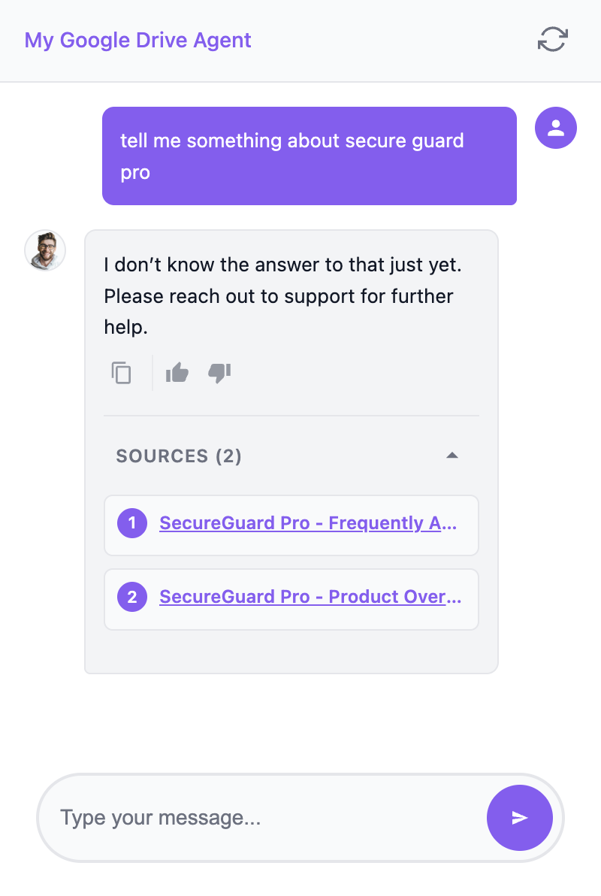
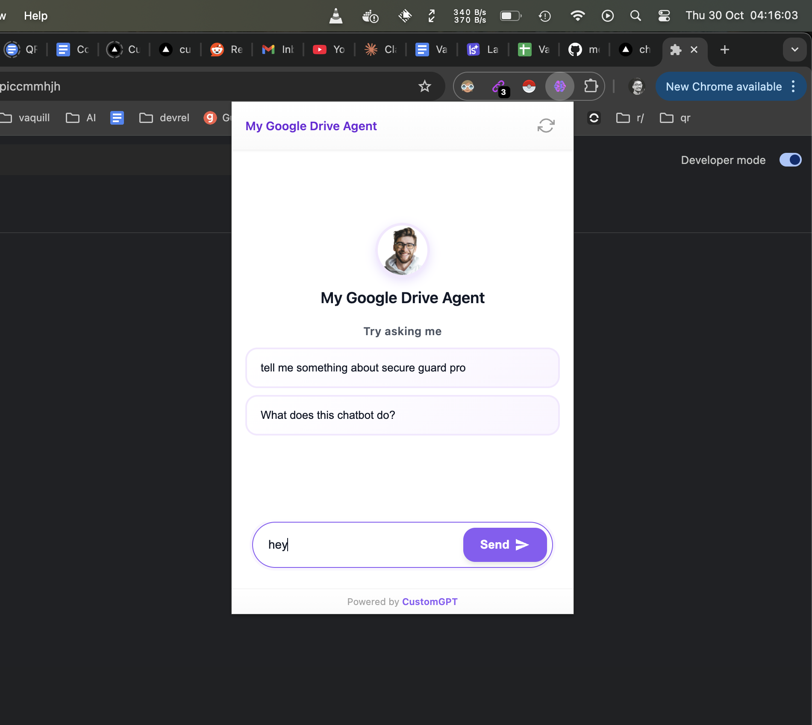

# CustomGPT Integrations & Tools

A comprehensive collection of integrations, widgets, and tools for CustomGPT.ai, allowing you to deploy AI-powered experiences across multiple platforms, websites, and messaging apps using your CustomGPT.ai agent's knowledge base.

You will need our API to use any of these below listed integration, [create your API key here](https://app.customgpt.ai/register?utm_source=github_integrations).

---

## 📑 Available Integrations

### 🤖 Messaging Platform Integrations

| Integration | Description | Key Features | Status |
|------------|-------------|--------------|---------|
| **[WhatsApp Bot](Whatsapp-Bot/README.md)** | Integrate with WhatsApp Business using Twilio API | Rich media, rate limiting, session management, starter questions | ✅ Ready |
| **[Discord Bot](Discord-Bot/README.md)** | AI-powered Discord server bot with slash commands | Slash commands, conversation memory, interactive UI, citations | ✅ Ready |
| **[Slack Bot](Slack-Bot/README.md)** | Enterprise Slack integration with multi-agent support | Multi-agent, threading, rate limiting, analytics | ✅ Ready |
| **[Telegram Bot](Telegram-Bot/README.md)** | Fast Telegram bot with polling and webhook support | Inline keyboards, conversation management, usage stats | ✅ Ready |
| **[MS Teams Bot](MS%20Teams/README.md)** | Enterprise Microsoft Teams bot with Adaptive Cards | @mentions, threading, Confluence integration, file attachments | ✅ Ready |
| **[Google Chat Bot](Google%20Chat-Bot/README.md)** | Native Google Workspace integration | Direct messages, space conversations, multi-agent support | ✅ Ready |
| **[Rocket.Chat Bot](Rocket%20Chat%20Bot/README.md)** | Self-hosted chat platform integration | AI responses, citation support, thread support, analytics | ✅ Ready |
| **[Instagram Bot](Instagram%20Chat%20Bot/README.md)** | Instagram DM bot with planned comment replies | Multi-agent, starter questions, rate limiting, typing indicators | 🚧 Beta |
| **[FB Messenger Bot](Facebook%20Messenger-Bot/README.md)** | Facebook Messenger integration | Quick replies, persistent menu, typing indicators, media support | 🚧 WIP |

### 💻 Website Widgets & Embeds

| Integration | Description | Key Features | Status |
|------------|-------------|--------------|---------|
| **[CustomGPT Widget (Python)](customgpt-widget/README.md)** | Voice-enabled AI assistant with 3D avatar and particle animations | Voice mode (VAD), 3D avatar with lip-sync, multiple TTS providers, chat mode, floating/inline embed | ✅ Ready |
| **[CustomGPT Widget (Next.js)](customgpt-widget-next/README.md)** | Modern Next.js widget with voice and with one-click Vercel deployment | Next.js App Router, voice mode, TTS support, serverless functions, TypeScript | ✅ Ready |

### 🔧 Browser Extensions & Automation

| Integration | Description | Key Features | Status |
|------------|-------------|--------------|---------|
| **[Chrome Extension](chrome-extension/README.md)** | White-label Chrome extension with Vercel proxy | Zero user setup, white-label ready, modern UI, citations, Vercel backend | ✅ Ready |
| **[n8n/Make.com](n8n-make.com%20integration/)** | Workflow automation templates and blueprints | Google Sheets integration, workflow templates, API examples | ✅ Ready |

---

## 🎯 Quick Navigation

- [Overview](#overview)
- [Feature Comparison](#feature-comparison)
- [Quick Start Guide](#quick-start-guide)
- [Prerequisites](#prerequisites)
- [Deployment Options](#deployment-options)
- [Security Best Practices](#security-best-practices)
- [Support & Resources](#support--resources)
- [Contributing](#contributing)

---

## Overview

This monorepo contains **13 production-ready integrations** for CustomGPT across four major categories:

1. **Messaging Platforms** (9) - Deploy AI bots on WhatsApp, Slack, Discord, Teams, Telegram, and more
2. **Website Widgets** (2) - Embeddable chat widgets with voice, 3D avatars, and modern UI
3. **Browser Extensions** (1) - Chrome extension with white-label capabilities
4. **Workflow Automation** (1) - n8n/Make.com integration templates

All integrations are designed for easy deployment, customization, and white-labeling.

---

## Quick Start

1. **Get CustomGPT API Key**: [Sign up](https://app.customgpt.ai/register?utm_source=github_integrations) and create an agent
2. **Choose Integration**: Pick from the tables above
3. **Follow Setup Guide**: Each integration has detailed documentation
4. **Deploy**: Use free hosting options (Vercel, Railway, Google Apps Script, Docker Hub)

---

## Feature Comparison

### Messaging Platform Features

| Feature | WhatsApp | Discord | Slack | Telegram | Google Chat | MS Teams | Rocket.Chat | Instagram | FB Messenger |
|---------|----------|---------|-------|----------|-------------|----------|-------------|-----------|--------------|
| Free Hosting | ✔ | ✔ | ✔ | ✔ | ✔ | ✔ | ✔ | ✔ | 🚧 WIP |
| Rate Limiting | ✔ | ✔ | ✔ | ✔ | ✔ | ✔ | ✔ | ✔ | 🚧 WIP |
| Multi-Agent | ✖ | ✖ | ✔ | ✖ | ✔ | ✖ | ✖ | ✔ | 🚧 WIP |
| Rich Media | ✔ | ✔ | ✔ | ✔ | Limited | ✔ | ✔ | Limited | 🚧 WIP |
| Threading | ✖ | ✔ | ✔ | ✖ | ✔ | ✔ | ✔ | ✖ | 🚧 WIP |
| Analytics | ✔ | ✖ | ✔ | ✔ | ✖ | ✔ | ✔ | ✔ | 🚧 WIP |
| Confluence | ✖ | ✖ | ✖ | ✖ | ✖ | ✔ | ✖ | ✖ | 🚧 WIP |
| Setup Complexity | Medium | Easy | Medium | Easy | Easy | Medium | Medium | Medium | 🚧 WIP |

### Widget & Extension Features

| Feature | Widget (Python) | Widget (Next.js) | Chrome Extension |
|---------|----------------|------------------|------------------|
| Voice Mode | ✔ (VAD) | ✔ (WebM) | ✖ |
| 3D Avatar | ✔ | ✖ | ✖ |
| Chat Mode | ✔ | ✔ | ✔ |
| TTS Support | ✔ Multiple | ✔ Multiple | ✖ |
| Citations | ✔ | ✔ | ✔ |
| Reactions | ✔ | ✔ | ✔ |
| White-Label | ✔ | ✔ | ✔ |
| Docker Ready | ✔ | ✔ | ✖ |
| One-Click Deploy | ✔ | ✔ (Vercel) | ✔ (Vercel proxy) |
| Framework | FastAPI + Vue | Next.js | Vanilla JS |

---

## Deployment

All integrations support multiple deployment options. See individual README files for detailed instructions.

**Free Hosting**: Vercel, Railway, Render, Fly.io, Google Apps Script, Docker Hub
**Self-Hosting**: Docker, VPS, Kubernetes, Azure

---

## Support & Resources

### CustomGPT Resources

- **Landing Page**: [customgpt.ai](https://customgpt.ai)
- **Dashboard**: [app.customgpt.ai](https://app.customgpt.ai)
- **Live Demo**: [app.customgpt.ai/agents?demo=chat](https://app.customgpt.ai/agents?demo=chat)
- **API Documentation**: [docs.customgpt.ai/api-reference](https://docs.customgpt.ai/api-reference)
- **Postman Collection**: [postman.com/customgpt/customgpt/overview](https://www.postman.com/customgpt/customgpt/overview)
- **MCP Documentation**: [docs.customgpt.ai/model-content-protocol](https://docs.customgpt.ai/model-content-protocol)
- **Office Hours**: [calendly.com/pollthepeople/office-hours](https://calendly.com/pollthepeople/office-hours)
- **YouTube Channel**: [youtube.com/channel/UC6HOk7Z9OwVPNYiC7SKMJ6g](https://www.youtube.com/channel/UC6HOk7Z9OwVPNYiC7SKMJ6g)

### Integration-Specific Video Tutorials

- **Slack Bot Setup**: [youtu.be/5x2NMQ7qIvg](https://youtu.be/5x2NMQ7qIvg)
- **Discord Bot Setup**: [youtu.be/mhqIJZ8fFAk](https://youtu.be/mhqIJZ8fFAk)
- **Telegram Bot Setup**: [youtu.be/yqGZGcnqtg0](https://youtu.be/yqGZGcnqtg0)

### GitHub Resources

- **CustomGPT Starter Kit**: [github.com/Poll-The-People/customgpt-starter-kit](https://github.com/Poll-The-People/customgpt-starter-kit)
- **CustomGPT Integrations**: [github.com/Poll-The-People/customgpt-integrations](https://github.com/Poll-The-People/customgpt-integrations)

### Getting Help

- **CustomGPT Issues**: Check [CustomGPT docs](https://docs.customgpt.ai)
- **Integration Issues**: Open an issue in this repository
- **Platform-Specific Help**: Refer to platform documentation

---

## Contributing

Contributions welcome! Fork the repo, create a feature branch, and submit a PR. Follow existing patterns and add documentation.

---

## License

MIT License

---

**Total Integrations**: 13 (9 messaging platforms, 2 website widgets, 1 browser extension, 1 automation tool)
