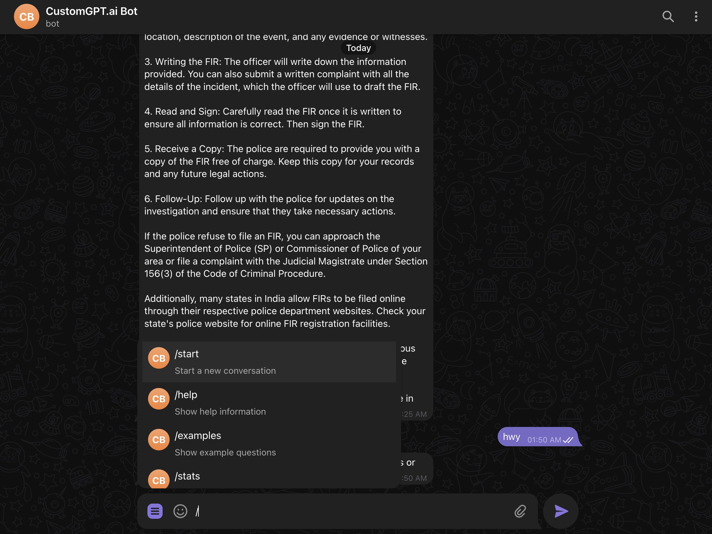

# Telegram Bot for CustomGPT

A Telegram bot that integrates with CustomGPT.ai to provide AI-powered responses using your custom knowledge base.

Get your [CustomGPT.ai RAG API key here](https://app.customgpt.ai/register?utm_source=github_integrations), needed to use this integration.



## Features

- **AI-Powered Responses**: Uses CustomGPT.ai's API to answer questions from your knowledge base
- **Conversation Management**: Maintains context within chat sessions
- **Rate Limiting**: Built-in daily (100) and per-minute (5) message limits
- **Starter Questions**: Interactive buttons with example queries
- **Usage Statistics**: Track your daily usage with `/stats`
- **Session Management**: 30-minute conversation timeout with auto-cleanup
- **Security**: SSL certificate handling and secure API communication

## Project Structure

```
Telegram-Bot/
├── bot.py                 # Main bot implementation (polling mode)
├── customgpt_client.py    # CustomGPT API client
├── simple_cache.py        # In-memory rate limiting & session management
├── requirements.txt       # Python dependencies
├── .env                   # Environment variables (create your own)
├── README.md             # This file
└── vercel-bot/           # Vercel webhook deployment
    ├── api/
    │   └── webhook.py    # Webhook handler for Vercel
    ├── vercel.json       # Vercel configuration
    └── set_webhook.py    # Webhook setup script
```

---

## Quick Start

### Prerequisites

- Python 3.8+
- Telegram Bot Token (from [@BotFather](https://t.me/botfather))
- CustomGPT.ai API Key and Project ID
- SSL certificates (handled automatically with certifi)

### Installation

1. **Clone the repository**:
   ```bash
   cd Telegram-Bot/
   ```

2. **Install dependencies**:
   ```bash
   pip install -r requirements.txt
   ```

3. **Set up environment variables**:
   Create a `.env` file:
   ```env
   TELEGRAM_BOT_TOKEN=your_bot_token_here
   CUSTOMGPT_API_KEY=your_api_key_here
   CUSTOMGPT_PROJECT_ID=your_project_id_here

   # Optional configuration
   DAILY_LIMIT=100
   MINUTE_LIMIT=5
   SESSION_TIMEOUT_MINUTES=30
   ```

### Running the Bot

#### Local Development (Polling Mode)
```bash
python bot.py
```

This runs the bot in polling mode - perfect for development and testing.

---

## Bot Commands

- `/start` - Welcome message with example question buttons
- `/help` - Show available commands and tips
- `/examples` - Display example questions you can ask
- `/stats` - View your usage statistics
- `/clear` - Clear conversation history and start fresh

---

## Deployment Options

### Option 1: Vercel (Webhook Mode) - Free

**Best for**: Simple bots with quick responses

**Pros**:
- Completely free
- Auto-scaling
- HTTPS included
- Easy deployment

**Cons**:
- 10-second timeout limit
- No persistent storage
- Cold starts
- No rate limiting

#### Vercel Setup Instructions

##### Prerequisites
- Telegram Bot Token (from [@BotFather](https://t.me/botfather))
- CustomGPT API Key and Project ID
- Vercel account (free at [vercel.com](https://vercel.com))
- Git installed locally

##### Deployment Steps

**Option A: Deploy via Vercel CLI**

```bash
# Install Vercel CLI
npm i -g vercel

# Login to Vercel
vercel login

# Navigate to vercel-bot directory
cd vercel-bot

# Deploy (follow prompts)
vercel

# Set environment variables
vercel env add TELEGRAM_BOT_TOKEN production
vercel env add CUSTOMGPT_API_KEY production
vercel env add CUSTOMGPT_PROJECT_ID production

# Redeploy to apply env vars
vercel --prod
```

**Option B: Deploy via GitHub**
1. Push code to GitHub repository
2. Connect repository to Vercel
3. Add environment variables in Vercel dashboard
4. Deploy

##### Set Telegram Webhook

After deployment, set your bot's webhook:

```python
import requests

BOT_TOKEN = "your_bot_token_here"
WEBHOOK_URL = "https://your-project.vercel.app/api/webhook"

response = requests.post(
    f"https://api.telegram.org/bot{BOT_TOKEN}/setWebhook",
    json={"url": WEBHOOK_URL}
)
print(response.json())
```

Or use curl:
```bash
curl -X POST "https://api.telegram.org/bot<BOT_TOKEN>/setWebhook" \
     -H "Content-Type: application/json" \
     -d '{"url": "https://your-project.vercel.app/api/webhook"}'
```

##### Test Your Bot
1. Open Telegram and search for your bot
2. Send `/start` to begin
3. Ask any question!

#### Vercel Limitations

##### 10-Second Timeout
Vercel serverless functions have a **10-second execution timeout** on the free tier. This means:
- Each webhook request (Telegram message) must complete within 10 seconds
- This includes: receiving message → calling CustomGPT API → sending response
- If CustomGPT takes too long to respond, the function will timeout
- The bot uses 8-second timeouts for API calls to stay within limits

##### Other Limitations
- **No persistent storage**: Sessions reset on cold starts
- **No rate limiting**: Each request is independent
- **Cold starts**: First message after inactivity may be slower
- **No background tasks**: Can't do async processing

#### How Vercel Deployment Works

1. **Webhook Reception**: Telegram sends updates to `/api/webhook`
2. **Message Processing**: Bot processes commands or forwards to CustomGPT
3. **Session Management**: Maintains conversation context in memory
4. **Response Delivery**: Sends CustomGPT response back to user

### Option 2: Replit (Polling Mode) - Free with Limitations

**Best for**: Development and testing

**Pros**:
- Free tier available
- Persistent storage
- Web IDE
- Easy setup

**Cons**:
- Sleeps after inactivity
- Requires pinging to stay alive
- Limited resources

#### Replit Setup Instructions

##### Step 1: Create Replit Account
1. Go to [replit.com](https://replit.com)
2. Sign up for free

##### Step 2: Create New Repl
1. Click "Create Repl"
2. Choose "Python" template
3. Name it "customgpt-telegram-bot"

##### Step 3: Upload Files
Upload these files to your Repl:
- `bot.py`
- `customgpt_client.py`
- `simple_cache.py`
- `requirements.txt`

##### Step 4: Set Environment Variables
1. Click "Secrets" (lock icon) in left sidebar
2. Add these secrets:
   - `TELEGRAM_BOT_TOKEN` = your bot token
   - `CUSTOMGPT_API_KEY` = your API key
   - `CUSTOMGPT_PROJECT_ID` = your project ID

##### Step 5: Update bot.py for Replit
Add this at the top of bot.py:
```python
import os
# Replit uses Secrets instead of .env
BOT_TOKEN = os.environ.get('TELEGRAM_BOT_TOKEN')
CUSTOMGPT_API_KEY = os.environ.get('CUSTOMGPT_API_KEY')
CUSTOMGPT_PROJECT_ID = os.environ.get('CUSTOMGPT_PROJECT_ID')
```

##### Step 6: Create main.py
```python
from bot import main

if __name__ == '__main__':
    main()
```

##### Step 7: Run the Bot
1. Click "Run" button
2. Your bot should start!

##### Step 8: Keep Bot Alive (Optional)
For free tier with better uptime:
1. Set up UptimeRobot to ping your Repl every 5 minutes
2. Your Repl URL: `https://your-repl-name.your-username.repl.co`

#### Replit-Specific Files

**.replit**
```toml
run = "python bot.py"
language = "python3"

[packager]
language = "python3"
```

**replit.nix**
```nix
{ pkgs }: {
  deps = [
    pkgs.python39
    pkgs.python39Packages.pip
  ];
}
```

### Option 3: Railway (Polling/Webhook) - Paid

**Best for**: Production bots

**Pros**:
- No timeout limits
- Persistent storage options
- Better performance
- Supports both modes

**Cons**:
- Requires payment
- More complex setup

#### Railway Setup

1. **Install Railway CLI**:
```bash
npm install -g @railway/cli
```

2. **Deploy**:
```bash
railway login
railway init
railway up
```

3. **Add environment variables in Railway dashboard**:
   - `TELEGRAM_BOT_TOKEN`
   - `CUSTOMGPT_API_KEY`
   - `CUSTOMGPT_PROJECT_ID`

### Option 4: VPS/Cloud (Any Mode) - Varies

**Best for**: Full control

**Options**:
- AWS EC2 (free tier)
- Google Cloud (free tier)
- DigitalOcean ($5/month)
- Any Linux VPS

#### VPS Setup

1. **Install Python and dependencies**:
```bash
sudo apt update
sudo apt install python3 python3-pip
pip3 install -r requirements.txt
```

2. **Set up environment variables**:
```bash
export TELEGRAM_BOT_TOKEN="your_token"
export CUSTOMGPT_API_KEY="your_key"
export CUSTOMGPT_PROJECT_ID="your_project_id"
```

3. **Run bot**:
```bash
python3 bot.py
```

4. **Set up systemd service (optional)**:
```ini
[Unit]
Description=Telegram CustomGPT Bot
After=network.target

[Service]
Type=simple
User=youruser
WorkingDirectory=/path/to/bot
Environment="TELEGRAM_BOT_TOKEN=your_token"
Environment="CUSTOMGPT_API_KEY=your_key"
Environment="CUSTOMGPT_PROJECT_ID=your_project_id"
ExecStart=/usr/bin/python3 bot.py
Restart=always

[Install]
WantedBy=multi-user.target
```

### Deployment Comparison

| Platform | Best For | Cost | Persistent Storage | Rate Limiting | Timeout |
|----------|----------|------|-------------------|---------------|---------|
| **Vercel** | Simple bots | Free | No | No | 10s |
| **Replit** | Development | Free* | Yes | Yes | None |
| **Railway** | Production | Paid | Yes | Yes | None |
| **VPS** | Full control | Varies | Yes | Yes | None |

*Free tier sleeps after inactivity

### Recommended Strategy

1. **Development/Testing**: Replit or local polling
2. **Simple production**: Vercel (if responses are fast)
3. **Production with complex queries**: Railway or VPS
4. **Enterprise/High traffic**: VPS with load balancing

---

## Technical Details

### Rate Limiting
- **Daily Limit**: 100 messages per user
- **Minute Limit**: 5 messages per minute
- **Implementation**: In-memory cache (resets on restart)

### Session Management
- **Timeout**: 30 minutes of inactivity
- **Storage**: In-memory (non-persistent)
- **Cleanup**: Automatic for expired sessions

### API Integration
- **CustomGPT API**: RESTful API with streaming support
- **SSL Handling**: Uses certifi for certificate verification
- **Error Handling**: Graceful degradation with user-friendly messages

---

## Common Issues & Solutions

### SSL Certificate Error (macOS)
```python
# Already fixed in customgpt_client.py
import certifi
import ssl
ssl_context = ssl.create_default_context(cafile=certifi.where())
```

### Bot Not Responding
1. Check bot token is correct
2. Verify API credentials
3. Ensure bot is running (`python bot.py`)
4. Check network connectivity

**For webhook mode**:
- Check webhook is set correctly: `https://api.telegram.org/bot<TOKEN>/getWebhookInfo`
- Verify environment variables in hosting platform dashboard
- Check function logs for errors

### Rate Limit Exceeded
- Wait for the timeout period
- Daily limits reset at midnight
- Minute limits reset after 60 seconds

### Session Expired
- Use `/clear` to start a new conversation
- Sessions timeout after 30 minutes of inactivity

### Vercel Timeout Errors
- CustomGPT API might be slow - the bot has 8-second timeout
- Consider implementing a "thinking..." message for long responses
- For complex queries, responses might timeout
- Consider using Railway or VPS for complex bots

### Sessions Reset Frequently (Vercel/Serverless)
- This is normal behavior on serverless platforms
- Each cold start resets the in-memory session cache
- Consider using a database for persistent sessions (requires paid tier)

---

## Development

### Testing Locally
1. Use polling mode for easier debugging
2. Set lower rate limits for testing
3. Use `/stats` to monitor usage

### Adding Features
- Extend `handle_message` in `bot.py` for new commands
- Modify `simple_cache.py` for persistence
- Update `customgpt_client.py` for API changes

### Debugging
```python
# Enable debug logging
import logging
logging.basicConfig(level=logging.DEBUG)
```

---

## Security Considerations

1. **Never commit `.env` file** - It contains sensitive credentials
2. **Use environment variables** for all secrets
3. **Implement user allowlisting** if needed:
   ```python
   ALLOWED_USERS = [123456789]  # Telegram user IDs
   ```
4. **Monitor usage** with `/stats` command
5. **Set appropriate rate limits** based on your needs

---

## Future Enhancements

- [ ] Persistent storage (PostgreSQL/Redis)
- [ ] User authentication
- [ ] Admin dashboard
- [ ] Multiple language support
- [ ] Voice message support
- [ ] Image analysis capabilities
- [ ] Docker containerization

---

## Support

### CustomGPT Links

- **[CustomGPT Landing Page](https://customgpt.ai)**
- **[Live Demo](https://app.customgpt.ai/agents?demo=chat)**
- **[CustomGPT Starter Kit](https://github.com/Poll-The-People/customgpt-starter-kit)**
- **[CustomGPT Integrations](https://github.com/Poll-The-People/customgpt-integrations)**
- **[API Documentation](https://docs.customgpt.ai/api-reference)**
- **[Postman Collection](https://www.postman.com/customgpt/customgpt/overview)**
- **[MCP Documentation](https://docs.customgpt.ai/model-content-protocol)**
- **[Office Hours](https://calendly.com/pollthepeople/office-hours)**
- **[YouTube Channel](https://www.youtube.com/channel/UC6HOk7Z9OwVPNYiC7SKMJ6g)**

### Video Tutorial

- **[Telegram Bot Setup Video](https://youtu.be/yqGZGcnqtg0)**

### Platform Documentation

- Telegram Bot Documentation: [core.telegram.org/bots/api](https://core.telegram.org/bots/api)

### Troubleshooting

For issues:
1. Check the [Common Issues](#common-issues--solutions) section
2. Review logs for error messages
3. Ensure all prerequisites are met
4. Verify API credentials are correct

For CustomGPT API issues, check the resources above.
For Telegram Bot API issues, check [Telegram Bot Documentation](https://core.telegram.org/bots/api).

---

## License

MIT

---

**Ready to deploy?** Choose your hosting option above and follow the deployment guide!
