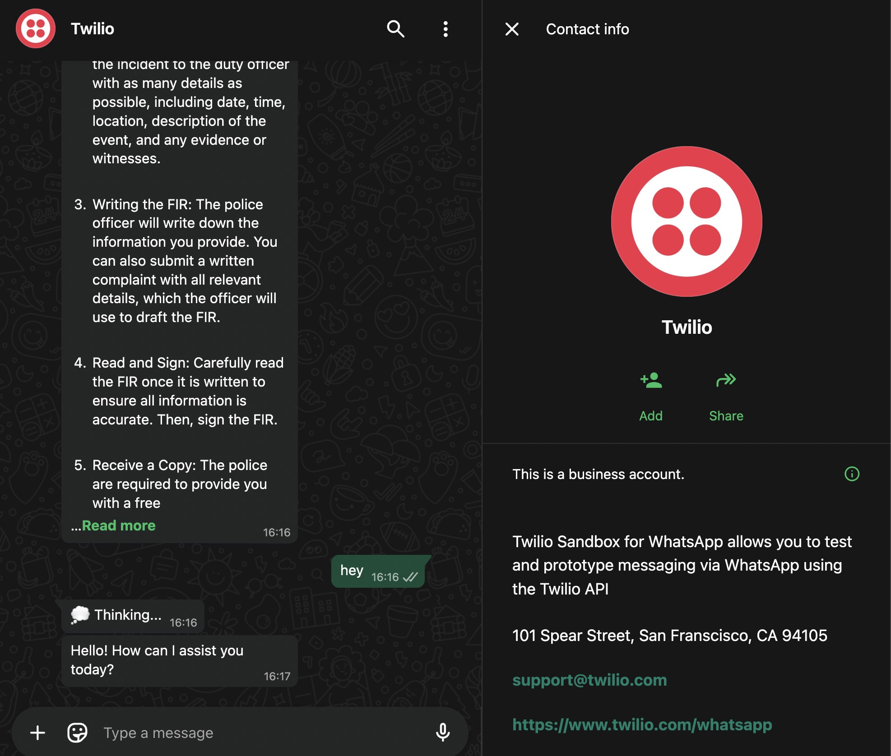

# WhatsApp Bot for CustomGPT

A WhatsApp bot that integrates with CustomGPT's API to provide intelligent responses from your agent's knowledge base.

Get your [CustomGPT.ai RAG API key here](https://app.customgpt.ai/register?utm_source=github_integrations), needed to use this integration.



## Features

- 🤖 **AI-Powered Responses**: Uses CustomGPT's knowledge base
- 🔒 **Security**: Rate limiting, user authentication, query validation
- 💬 **Rich Interactions**: Starter questions, inline buttons, media support
- 📊 **Analytics**: Usage tracking and statistics
- 🌍 **Multi-language Support**: Configurable response language
- ⚡ **Performance**: Response caching, session management
- 🚀 **Easy Deployment**: Multiple free hosting options

## Prerequisites

- Python 3.8+
- CustomGPT API credentials (API key and Agent ID)
- Twilio account with WhatsApp sandbox access

## Quick Start (15 minutes)

### 1. Clone and Install

```bash
cd whatsapp
pip install -r requirements.txt
```

### 2. Configuration

Create a `.env` file:

```env
# CustomGPT Configuration
CUSTOMGPT_API_KEY=your_api_key_here
CUSTOMGPT_PROJECT_ID=your_agent_id_here
CUSTOMGPT_API_URL=https://app.customgpt.ai

# Twilio Configuration
TWILIO_ACCOUNT_SID=your_account_sid_here
TWILIO_AUTH_TOKEN=your_auth_token_here
TWILIO_WHATSAPP_NUMBER=whatsapp:+14155238886

# Rate Limiting
RATE_LIMIT_DAILY=100
RATE_LIMIT_MINUTE=5
RATE_LIMIT_HOUR=30

# Security
ALLOWED_NUMBERS=+1234567890,+0987654321  # Optional: Whitelist specific numbers
BLOCKED_NUMBERS=+1111111111              # Optional: Block specific numbers
MAX_MESSAGE_LENGTH=500

# Redis (for production)
REDIS_URL=redis://localhost:6379         # Optional: For persistent rate limiting

# Features
ENABLE_VOICE_MESSAGES=true
ENABLE_MEDIA_RESPONSES=true
ENABLE_LOCATION_SHARING=false
DEFAULT_LANGUAGE=en
```

### 3. Set Up Twilio WhatsApp Sandbox

#### Get Twilio Credentials

1. Sign up at [twilio.com](https://www.twilio.com) (free trial with $15 credit)
2. Log in to [Twilio Console](https://console.twilio.com)
3. Go to "Account" → "API keys & tokens" OR click Phone Number section (choose "developer" when logging in)
4. Note your:
   - **Account SID** (starts with "AC")
   - **Auth Token**
   - **WhatsApp number**

#### Join WhatsApp Sandbox

1. In Twilio Console, go to "Messaging" → "Try it out" → "Send a WhatsApp message"
2. Follow instructions to join the sandbox
3. You'll send "join [your-keyword]" to the Twilio WhatsApp number
4. Note your sandbox number (e.g., `whatsapp:+14155238886`)

### 4. Run the Bot

**Important**: You need TWO terminal windows for local development:

**Terminal 1 - Run the bot**:
```bash
# Development mode
python bot.py

# OR Production mode with uvicorn
uvicorn bot:app --host 0.0.0.0 --port 8000
```

**Terminal 2 - Run ngrok** (for local testing):
```bash
# First time: Sign up at https://dashboard.ngrok.com and get your authtoken
ngrok config add-authtoken YOUR_AUTH_TOKEN

# Then expose your local server
ngrok http 8000
```

📌 **Both must be running simultaneously** for the bot to work!

### 5. Configure Twilio Webhook

1. Copy the HTTPS URL from ngrok (e.g., `https://abc123.ngrok-free.app`)
2. In [Twilio Console](https://console.twilio.com), go to Messaging → Try it out → Send a WhatsApp message
3. In "Sandbox Configuration", set webhook URL to: `https://YOUR-NGROK-URL.ngrok-free.app/webhook/whatsapp`
4. Method: POST
5. Save the configuration
6. Test by sending a message!

⚠️ **Note**: ngrok URL changes each time you restart it. Update Twilio webhook accordingly.

### 6. Test Your Bot

1. Send "Hi" to your Twilio WhatsApp number
2. You should receive a welcome message
3. Try asking questions related to your CustomGPT knowledge base

## ngrok Setup Guide (Detailed)

### Step 1: Create ngrok Account

1. Go to https://dashboard.ngrok.com/signup
2. Sign up for a free account (no credit card required)
3. Verify your email

### Step 2: Get Your Auth Token

1. After signing in, go to: https://dashboard.ngrok.com/get-started/your-authtoken
2. Copy your authtoken (looks like: `2abc123XYZ...`)

### Step 3: Configure ngrok

```bash
ngrok config add-authtoken YOUR_AUTH_TOKEN_HERE
```

### Step 4: Start ngrok

```bash
ngrok http 8000
```

You'll see output like:
```
Session Status                online
Account                       your-email@example.com
Forwarding                    https://abc123.ngrok-free.app -> http://localhost:8000
```

### Troubleshooting ngrok

**Bot not responding?**
1. Check ngrok is still running
2. Check your bot is running (`python bot.py`)
3. Check Twilio webhook URL is correct
4. Look for errors in bot terminal

**ngrok URL changed?**
- ngrok free tier gives you a new URL each time
- When you restart ngrok: copy new URL → update in Twilio Console → save

**Want a permanent URL?**
- Upgrade to ngrok paid plan for custom domains
- Or use deployment options (Railway, Render, etc.)

## WhatsApp Sandbox Limitations

**You're currently using the FREE Twilio WhatsApp Sandbox**, which has these limitations:

- **Join Required**: Users must first send "join [your-keyword]" to activate
- **24-Hour Window**: You can only reply within 24 hours of receiving a message
- **Shared Number**: Messages come from Twilio's number, not your own
- **Development Only**: Not suitable for production use

**After 24 hours of inactivity**, you can only send pre-approved template messages (requires paid account).

### Sandbox vs Production Comparison

| Feature | Sandbox (Free) | Production (Paid) |
|---------|---------------|-------------------|
| **Cost** | Free | ~$15/month + $0.005/message |
| **Phone Number** | Twilio's shared number | Your own business number |
| **User Onboarding** | Must send "join [keyword]" | Direct messaging |
| **Message Window** | 24 hours after user message | 24 hours + templates |
| **Business Profile** | Twilio's profile | Your verified business |
| **Suitable For** | Development & testing | Real customers |
| **Account Type** | Trial account OK | Paid account required |
| **Setup Time** | 5 minutes | 2-5 days (verification) |

### Getting Your Own WhatsApp Business Number

**To get your own WhatsApp Business number** (Required for production):
1. **Upgrade to paid Twilio account** (trial accounts can't register WhatsApp senders)
2. Register your WhatsApp Business Profile
3. Get Facebook Business verification
4. Submit message templates for approval
5. Monthly fees apply + per-message costs

Learn more: [Twilio WhatsApp API Docs](https://www.twilio.com/docs/whatsapp/api)

---

## Deployment Options

Complete guide for deploying your CustomGPT WhatsApp bot to various free hosting providers.

### Option 1: Railway (Recommended)

**Free Tier**: 500 hours/month, $5 credit

#### Steps:

1. **Sign up** at [railway.app](https://railway.app)

2. **Install Railway CLI** (optional):
   ```bash
   npm install -g @railway/cli
   ```

3. **Deploy via GitHub**:
   - Push your code to GitHub
   - Click "New Project" → "Deploy from GitHub repo"
   - Select your repository
   - Railway auto-detects Python

4. **Configure Environment Variables**:
   - Go to your project → Variables
   - Add all variables from `.env`:
     ```
     CUSTOMGPT_API_KEY=your_key
     CUSTOMGPT_PROJECT_ID=your_id
     TWILIO_ACCOUNT_SID=your_sid
     TWILIO_AUTH_TOKEN=your_token
     TWILIO_WHATSAPP_NUMBER=whatsapp:+14155238886
     RATE_LIMIT_DAILY=100
     # ... add all other variables
     ```

5. **Get your URL**:
   - Go to Settings → Domains
   - Your URL will be like: `https://your-app.up.railway.app`

6. **Configure Twilio Webhook**:
   - In Twilio Sandbox settings
   - Set webhook URL: `https://your-app.up.railway.app/webhook/whatsapp`
   - Method: POST
   - Save

#### CLI Deployment:

```bash
# Login
railway login

# Initialize project
railway init

# Link to existing project
railway link

# Deploy
railway up

# View logs
railway logs
```

### Option 2: Render

**Free Tier**: 750 hours/month

#### Steps:

1. **Sign up** at [render.com](https://render.com)

2. **Create New Web Service**:
   - Click "New +" → "Web Service"
   - Connect GitHub repository
   - Select your repo

3. **Configure Service**:
   - Name: `customgpt-whatsapp-bot`
   - Environment: `Python 3`
   - Build Command: `pip install -r requirements.txt`
   - Start Command: `python bot.py`

4. **Add Environment Variables**:
   - Go to Environment tab
   - Add all variables from `.env`

5. **Deploy**:
   - Click "Create Web Service"
   - Wait for deployment
   - Note your URL: `https://your-app.onrender.com`

6. **Configure Twilio**:
   - Set webhook: `https://your-app.onrender.com/webhook/whatsapp`

### Option 3: Fly.io

**Free Tier**: 3 shared-cpu-1x VMs

#### Steps:

1. **Install Fly CLI**:
   ```bash
   curl -L https://fly.io/install.sh | sh
   ```

2. **Sign up and login**:
   ```bash
   fly auth signup
   # or
   fly auth login
   ```

3. **Launch app**:
   ```bash
   cd whatsapp
   fly launch
   ```
   - Choose app name
   - Select region (closest to you)
   - Don't deploy yet

4. **Configure secrets**:
   ```bash
   fly secrets set CUSTOMGPT_API_KEY="your_key"
   fly secrets set CUSTOMGPT_PROJECT_ID="your_id"
   fly secrets set TWILIO_ACCOUNT_SID="your_sid"
   fly secrets set TWILIO_AUTH_TOKEN="your_token"
   fly secrets set TWILIO_WHATSAPP_NUMBER="whatsapp:+14155238886"
   # Set all other secrets
   ```

5. **Deploy**:
   ```bash
   fly deploy
   ```

6. **Get URL**:
   ```bash
   fly status
   # Your URL: https://your-app.fly.dev
   ```

7. **Configure Twilio**:
   - Set webhook: `https://your-app.fly.dev/webhook/whatsapp`

### Option 4: Google Apps Script

**Free Tier**: Unlimited (with quotas)

Simplest option - no server needed!

#### Steps:

1. **Go to** [script.google.com](https://script.google.com)

2. **Create new project**

3. **Copy code** from `google-apps-script/Code.gs`

4. **Set Script Properties**:
   - Project Settings → Script Properties
   - Add all required properties

5. **Deploy**:
   - Deploy → New Deployment
   - Type: Web app
   - Execute as: Me
   - Access: Anyone

6. **Get URL** and configure in Twilio

**⚠️ Warning**: May timeout with complex queries (only "Thinking..." message sent)

See detailed instructions in `google-apps-script/README.md`

### Other Free Alternatives

#### Koyeb

**Free Tier**: 2 services, 1 vCPU, 256MB RAM

```bash
# Install CLI
curl -fsSL https://cli.koyeb.com/install.sh | sh

# Deploy
koyeb app create customgpt-whatsapp
koyeb service create customgpt-whatsapp \
  --git github.com/yourusername/yourrepo \
  --git-branch main \
  --ports 8000:http \
  --routes /:8000
```

#### Cyclic.sh

**Free Tier**: 10,000 requests/month

1. Connect GitHub at [cyclic.sh](https://cyclic.sh)
2. Select repository
3. Add environment variables
4. Deploy

#### Deta Space

**Free Tier**: Always free, 10GB storage

```bash
# Install Space CLI
curl -fsSL https://get.deta.dev/space-cli.sh | sh

# Deploy
space new
space push
```

### Deployment Comparison

| Platform | Free Tier | Best For | Persistent Storage | Setup Time |
|----------|-----------|----------|-------------------|------------|
| **Railway** | $5 credit/month | Production | Yes | 10 min |
| **Render** | 750 hrs/month | Web services | Yes | 15 min |
| **Fly.io** | 3 shared VMs | Performance | Yes | 10 min |
| **Google Apps Script** | Unlimited* | Simple bots | No | 5 min |
| **Koyeb** | 2 services | Small projects | Yes | 10 min |

*With quotas

---

## Post-Deployment

### 1. Test Your Bot

1. Send "Hi" to your Twilio WhatsApp number
2. Check for welcome message
3. Test all commands

### 2. Monitor Logs

- **Railway**: `railway logs`
- **Render**: Dashboard → Logs
- **Fly.io**: `fly logs`
- **Apps Script**: View → Logs

### 3. Set Up Monitoring

1. **Uptime monitoring**:
   - Use [uptimerobot.com](https://uptimerobot.com) (free)
   - Monitor: `https://your-app.com/health`

2. **Error tracking**:
   - Add Sentry (free tier)
   - Or use built-in logging

### 4. Configure Production WhatsApp

Once tested, apply for WhatsApp Business API:
1. Apply through Twilio
2. Get approved number
3. Update webhook URL

---

## Bot Commands

- `/start` - Start conversation and show menu
- `/help` - Show available commands
- `/examples` - Show example questions
- `/stats` - View usage statistics
- `/language [code]` - Change response language
- `/clear` - Clear conversation history
- `/feedback` - Submit feedback

---

## Implementation Options

### Option 1: Twilio WhatsApp API (Currently Implemented) ✅

- **Pros**: Official API, reliable, quick setup, free sandbox
- **Cons**: Costs for production, requires Twilio account
- **Best for**: Rapid development, business use, production deployments

### Option 2: Meta WhatsApp Business API (Direct)

- **Pros**: Direct integration, no middleman fees
- **Cons**: Complex setup, business verification required (2-4 weeks), hosting requirements
- **Best for**: Large enterprises with dedicated infrastructure

**Why Not Use Meta's Direct API?**

You absolutely can! But consider:
- **Business Verification**: Meta requires extensive business documentation
- **Setup Complexity**: Multiple steps across Meta Business, Facebook App, WhatsApp Manager
- **Hosting Requirements**: Need HTTPS webhooks, SSL certificates
- **Approval Process**: Can take 2-4 weeks for production access

**Twilio Alternatives**:
1. **MessageBird** - Similar to Twilio, good European option
2. **Vonage (Nexmo)** - Enterprise-focused
3. **CM.com** - Good for high-volume
4. **360dialog** - Direct WhatsApp BSP
5. **WATI** - No-code option with UI

### Option 3: Google Apps Script (Alternative Implementation)

- **Pros**: Free hosting, easy deployment, no server needed
- **Cons**: Limited features, requires Twilio, **may timeout on long responses**
- **Best for**: Simple bots, testing, short responses

---

## Why Twilio and Redis?

### Why Twilio for WhatsApp?

WhatsApp has strict policies about third-party integrations. There are only two official ways to create WhatsApp bots:

1. **WhatsApp Business API (Direct)**
   - Requires business verification (can take weeks)
   - Complex setup with Facebook Business Manager
   - Need to host your own webhook server
   - Monthly fees even for small usage
   - Best for: Large enterprises

2. **WhatsApp Business API (via Providers like Twilio)**
   - Quick setup (minutes, not weeks)
   - Free sandbox for testing
   - Twilio handles the complex Meta/WhatsApp integration
   - Pay-as-you-go pricing
   - Best for: Most businesses and developers

### Why Redis?

**Redis is OPTIONAL!** The bot includes built-in memory storage that works perfectly for:
- Personal use
- Small teams (< 100 users)
- Single server deployments
- Testing and development

Redis is only beneficial when you need:
- Multiple bot instances (load balancing)
- Persistent rate limiting across restarts
- Shared session data between servers
- Very high user volumes (> 1000 users)

### Running Without Redis

This is already implemented! Just run the bot without setting `REDIS_URL`:

```python
# The bot automatically uses in-memory storage when Redis is not available
# No configuration needed - it just works!
```

### Cost Comparison

#### Twilio Costs (Pay as you go)
- **Sandbox**: FREE (perfect for testing)
- **Production**: ~$0.005 per message
- **Monthly**: $0 (no minimum fees)

#### Direct Meta API Costs
- **API Access**: FREE
- **But you need**:
  - SSL certificate (~$10-100/year)
  - Server hosting (~$5-20/month)
  - Domain name (~$12/year)
  - Time for verification (2-4 weeks)

#### Redis Costs
- **Development**: FREE (built-in memory storage)
- **Production Options**:
  - Redis Cloud: FREE tier (30MB)
  - Self-hosted: FREE (on your server)
  - Only needed for high-scale deployments

---

## Architecture & Development

### Core Components

1. **Bot Entry Point** (`bot.py`)
   - FastAPI application handling Twilio webhooks at `/webhook/whatsapp`
   - Async message processing with `process_message()` function
   - Health check endpoint at `/health`

2. **CustomGPT Integration** (`customgpt_client.py`)
   - Async client for CustomGPT API
   - Session creation and message handling
   - Supports both streaming and regular responses
   - OpenAI format compatibility

3. **Security Layer** (`security_manager.py`)
   - Phone number whitelist/blocklist validation
   - Message content validation (SQL injection, XSS, command injection)
   - Rate limit multiplier for admin users
   - Profanity filtering (optional)

4. **Rate Limiting** (`rate_limiter.py`)
   - Redis-backed with in-memory fallback
   - Daily, hourly, and minute limits
   - Per-user tracking and statistics

5. **Session Management** (`session_manager.py`)
   - Conversation context storage
   - Language preferences
   - TTL-based session expiry

### Development Commands

#### Local Development

```bash
# Install dependencies
pip install -r requirements.txt

# Run locally (development mode)
python bot.py

# Run with uvicorn (production mode)
uvicorn bot:app --host 0.0.0.0 --port 8000 --reload
```

#### Testing

```bash
# Run all tests
pytest

# Run with coverage
pytest --cov=. --cov-report=html

# Run specific test file
pytest test_bot.py -v
```

#### Code Quality

```bash
# Format code
black .

# Sort imports
isort .

# Lint code
flake8 .

# Type checking
mypy .
```

#### Docker

```bash
# Build image
docker build -t customgpt-whatsapp-bot .

# Run container
docker run -p 8000:8000 --env-file .env customgpt-whatsapp-bot
```

### Twilio Webhook Flow

1. Twilio sends POST request to `/webhook/whatsapp` with form data
2. Bot extracts message details from form data (From, Body, MessageSid)
3. Returns immediate TwiML response to acknowledge receipt
4. Processes message asynchronously to avoid timeout

### CustomGPT API Integration

- Uses session-based conversations (session_id required)
- Conversation creation requires a "name" field
- Messages API endpoint: `/api/v1/projects/{project_id}/conversations/{session_id}/messages`
- Supports streaming responses (not currently used in WhatsApp implementation)

---

## Security Features

1. **Rate Limiting**
   - Per-user daily/hourly/minute limits
   - Automatic reset at midnight
   - Customizable limits per user tier

2. **Message Validation**
   - Maximum message length enforcement
   - Spam detection
   - SQL injection prevention
   - Profanity filtering (optional)

3. **User Authentication**
   - Phone number whitelist/blacklist
   - Admin commands protection
   - Session management

4. **Data Protection**
   - No message logging by default
   - Encrypted session storage
   - GDPR compliance ready

---

## Advanced Features

### Starter Questions
The bot automatically suggests relevant questions based on:
- Your CustomGPT agent's knowledge base
- User's previous queries
- Popular questions

### Rich Media Support
- Send and receive images
- Voice message transcription
- Document handling
- Location-based queries

### Multi-turn Conversations
- Context retention across messages
- Session management
- Conversation history

### Analytics Dashboard
- User engagement metrics
- Popular queries
- Response times
- Error tracking

---

## Troubleshooting

### Common Issues

1. **Webhook not receiving messages**
   - Verify webhook URL in Twilio console
   - Check ngrok tunnel if testing locally
   - Ensure bot is running and accessible

2. **Authentication Error - Invalid Username**
   - Your Account SID should start with "AC" (not "US" or other prefixes)
   - Verify credentials in Twilio Console
   - Test with curl command below

3. **Rate limit errors**
   - Check Redis connection (optional)
   - Verify rate limit settings
   - Admin numbers get 10x higher limits

4. **CustomGPT API errors**
   - Verify API credentials
   - Check agent ID
   - Ensure agent is active

### Testing Twilio Credentials

Test your Twilio setup with this curl command:

```bash
curl 'https://api.twilio.com/2010-04-01/Accounts/YOUR_ACCOUNT_SID/Messages.json' -X POST \
--data-urlencode 'To=whatsapp:+1234567890' \
--data-urlencode 'From=whatsapp:+14155238886' \
--data-urlencode 'Body=Your appointment is coming up on July 21 at 3PM' \
-u YOUR_ACCOUNT_SID:YOUR_AUTH_TOKEN
```

Replace:
- `YOUR_ACCOUNT_SID`: Your Twilio Account SID (starts with AC)
- `YOUR_AUTH_TOKEN`: Your Twilio Auth Token
- `+1234567890`: Your WhatsApp number (recipient)
- `+14155238886`: Your Twilio sandbox number (or your WhatsApp Business number)

**Example Response** (201 - CREATED):
```json
{
  "account_sid": "ACxxxxxxxxxxxxxxxxxxxxxxxxxxxxxxxx",
  "api_version": "2010-04-01",
  "body": "Your appointment is coming up on July 21 at 3PM",
  "status": "queued",
  "to": "whatsapp:+917978307903",
  "from": "whatsapp:+14155238886"
}
```

**Status Codes**:
- `201 Created`: Message successfully queued for delivery
- `400 Bad Request`: Invalid parameters (check phone number format)
- `401 Unauthorized`: Invalid credentials
- `429 Too Many Requests`: Rate limit exceeded

### Debugging Tips

1. **Check logs**: The bot logs all incoming messages
2. **Test health endpoint**: `curl http://localhost:8000/health`
3. **Verify webhook**: Messages should appear in terminal
4. **Check Twilio Console**: Look for webhook logs and errors

### Debugging Webhook Issues

```bash
# Test webhook locally
curl -X POST http://localhost:8000/webhook/whatsapp \
  -H "Content-Type: application/x-www-form-urlencoded" \
  -d "From=whatsapp:+1234567890&Body=test&MessageSid=123"
```

### Bot Not Responding

1. **Check webhook URL**:
   ```bash
   curl -X POST https://your-app.com/webhook/whatsapp \
     -H "Content-Type: application/x-www-form-urlencoded" \
     -d "From=whatsapp:+1234567890&Body=test"
   ```

2. **Check logs** for errors

3. **Verify environment variables** are set

4. **Test Twilio connection**:
   ```python
   # Test script
   from twilio.rest import Client
   client = Client(account_sid, auth_token)
   message = client.messages.create(
     to='whatsapp:+1234567890',
     from_='whatsapp:+14155238886',
     body='Test message'
   )
   ```

### Rate Limiting Issues

1. Increase limits in environment variables
2. Implement Redis for production
3. Monitor usage with `/stats` command

### Memory Issues

1. **Add Redis** for session/rate limit storage
2. **Optimize code**:
   - Remove unused imports
   - Use connection pooling
   - Implement caching

### SSL/Security Issues

1. All platforms provide free SSL
2. Never expose sensitive credentials
3. Use environment variables only

---

## Scaling Considerations

When you outgrow free tiers:

1. **Upgrade hosting**:
   - Railway: Pay as you go
   - Render: $7/month starter
   - Fly.io: Pay for additional resources

2. **Add Redis**:
   - Redis Cloud free tier (30MB)
   - Or upgrade to paid Redis

3. **Implement queuing**:
   - For high message volume
   - Use Redis + background workers

4. **Multiple instances**:
   - Load balance across instances
   - Share Redis for state

---

## Security Best Practices

1. **Environment Variables**:
   - Never commit `.env` file
   - Use platform secret management

2. **Webhook Security**:
   - Validate Twilio signatures
   - Implement request validation

3. **Rate Limiting**:
   - Always enabled
   - Monitor for abuse

4. **Access Control**:
   - Implement phone number whitelist
   - Admin commands protection

---

## Quick Setup Checklist

Before troubleshooting, ensure:
- [ ] Bot is running (`python bot.py`) - Terminal 1
- [ ] ngrok is running (`ngrok http 8000`) - Terminal 2
- [ ] Webhook URL is updated in Twilio Console
- [ ] You've joined the sandbox (sent "join [keyword]")
- [ ] Your phone number is in `ALLOWED_NUMBERS` in `.env`

---

## Resources

### CustomGPT Links
- **[CustomGPT Landing Page](https://customgpt.ai)**
- **[Live Demo](https://app.customgpt.ai/agents?demo=chat)**
- **[CustomGPT Starter Kit](https://github.com/Poll-The-People/customgpt-starter-kit)**
- **[CustomGPT Integrations](https://github.com/Poll-The-People/customgpt-integrations)**
- **[API Documentation](https://docs.customgpt.ai/api-reference)**
- **[Postman Collection](https://www.postman.com/customgpt/customgpt/overview)**
- **[MCP Documentation](https://docs.customgpt.ai/model-content-protocol)**
- **[Office Hours](https://calendly.com/pollthepeople/office-hours)**
- **[YouTube Channel](https://www.youtube.com/channel/UC6HOk7Z9OwVPNYiC7SKMJ6g)**

### Platform Documentation
- Twilio WhatsApp API Documentation: [twilio.com/docs/whatsapp/api](https://www.twilio.com/docs/whatsapp/api)

---

## Contributing

Feel free to submit issues and enhancement requests!

## License

MIT
