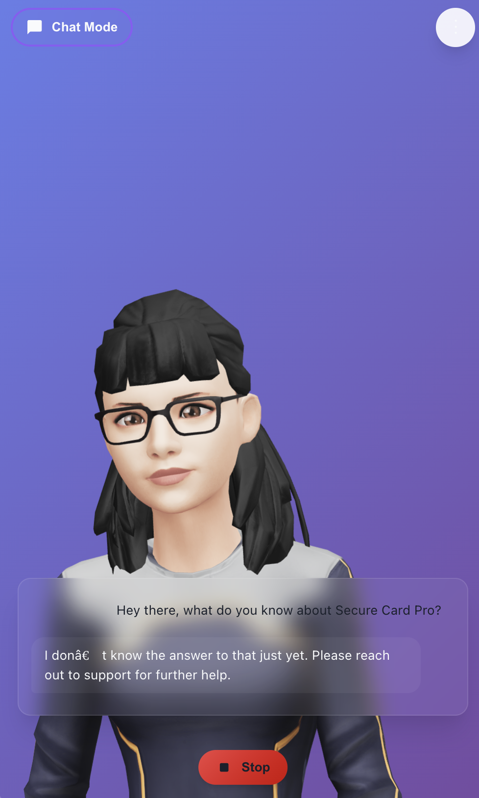
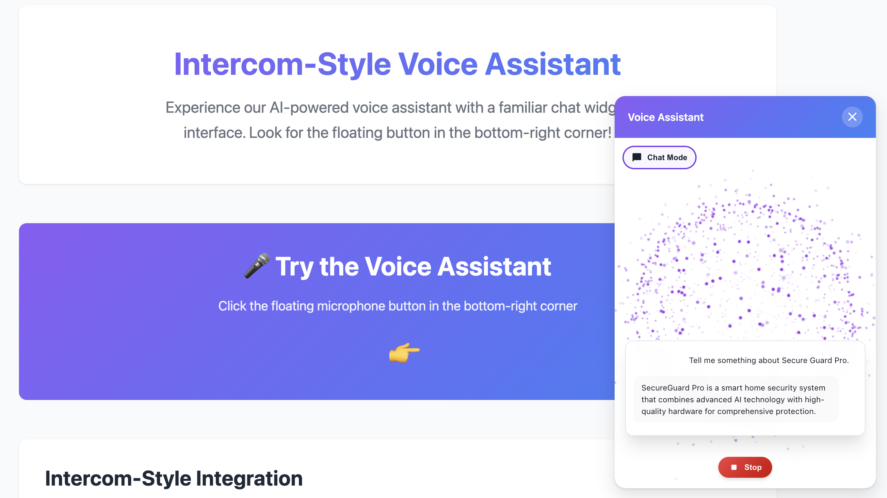
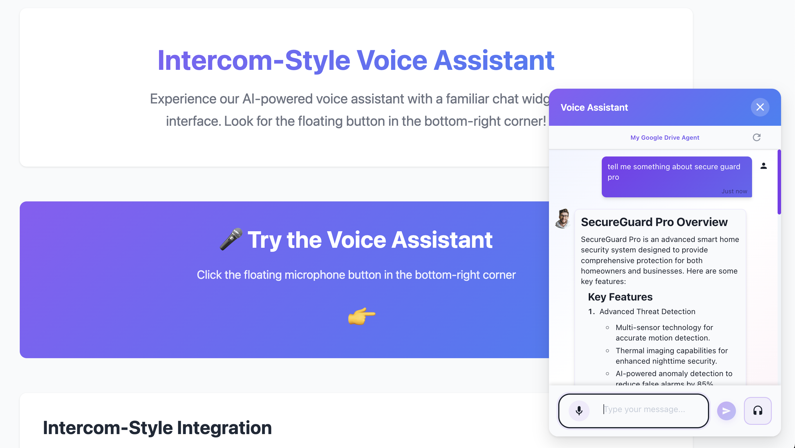
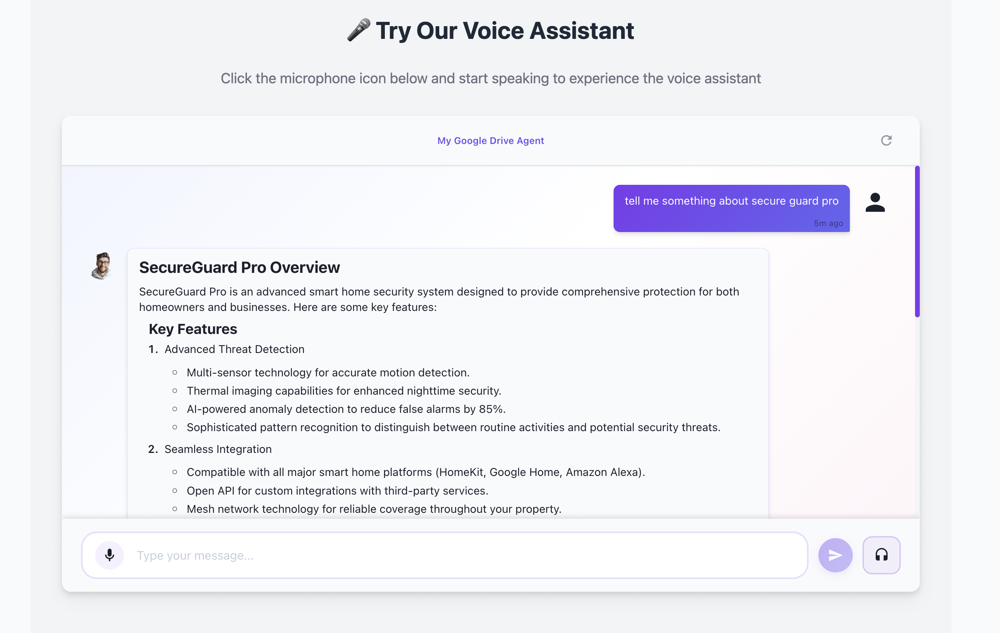

# CustomGPT Widget - Voice-Enabled AI Assistant

A dual-mode AI assistant with voice and chat interfaces. Interact naturally through voice with real-time particle animations or 3D avatar, or use the text-based chat interface with message reactions and citations.

Get you [CustomGPT.ai RAG API key here](https://app.customgpt.ai/register?utm_source=github_integrations), needed to use this integration. 

## Screenshots

<div align="center">
  
  
</div>

<div align="center">
  
  
</div>

*Clockwise from top-left: Avatar mode with 3D character, Voice mode with particle animations, Inline embedded chat, Floating chatbot widget*

## Features

### Voice Mode

- **Voice Activity Detection** - Automatic speech detection, no button pressing required
- **3D Avatar with Lip-Sync** - Realistic avatar with facial expressions and gestures (NEW!)
- **Particle Animation Interface** - Visual feedback with dynamic particle effects
- **Multiple TTS Providers** - Choose from OpenAI TTS, gTTS, ElevenLabs, Edge TTS, or StreamElements
- **Avatar States** - Dynamic mood changes and gestures during conversation (listening, thinking, speaking)

### Chat Mode

- **Text-Based Chat** - Full-featured chat interface with markdown support
- **Message Reactions** - Like/dislike AI responses for feedback
- **Citations** - Hover over citations to see source details
- **Per-Message TTS** - Play any message as audio with speaker button
- **Speech Input** - Use microphone button for voice-to-text input

### Shared Features

- **AI-Powered Responses** - Powered by CustomGPT for RAG-based responses or OpenAI for general chat
- **Conversation Memory** - Maintains context across the conversation
- **Multi-language Support** - Configure language for both speech recognition and synthesis
- **Docker Ready** - Easy deployment with Docker

## Prerequisites

**For Docker Deployment:**
- Docker 20.10+ installed ([Download](https://www.docker.com/get-started))
- OpenAI API key ([Get one](https://platform.openai.com/api-keys))

**For Local Development:**
- Python 3.10+
- Node.js 18+
- FFmpeg ([Install guide](https://ffmpeg.org/download.html))
- Yarn (`npm install -g yarn`)
- OpenAI API key

## Table of Contents

- [Quick Start (Docker)](#quick-start-docker)
- [Docker Hub Deployment](#docker-hub-deployment)
- [Local Development](#local-development)
- [Website Integration](#website-integration)
- [Avatar Mode](#avatar-mode-3d-talking-avatar)
- [Configuration](#configuration)
- [TTS Provider Options](#tts-provider-options)
- [CustomGPT Integration](#customgpt-integration)
- [AI Model Configuration](#ai-model-configuration)
- [Troubleshooting](#troubleshooting)

## Quick Start (Docker)

### 1. Create `.env` file

```bash
# Required
OPENAI_API_KEY=sk-your-key-here

# Recommended
AI_COMPLETION_MODEL=gpt-4o-mini
TTS_PROVIDER=OPENAI
OPENAI_TTS_VOICE=nova
LANGUAGE=en
```

### 2. Run container

```bash
chmod +x run.sh  # First time only
./run.sh
```

### 3. Open browser

Visit `http://localhost:8000` and allow microphone access.

---

## Docker Hub Deployment

### Using Pre-built Image

The fastest way to deploy is using the pre-built Docker image:

```bash
docker pull zriyansh/customgpt-widget:latest
```

**Supported Architectures**: AMD64, ARM64 (Mac M1/M2, Raspberry Pi)

### Method 1: Docker Run (Simple)

```bash
docker run -d \
  --name customgpt-widget \
  -p 8000:8000 \
  -e OPENAI_API_KEY=your_key_here \
  -e AI_COMPLETION_MODEL=gpt-4o-mini \
  -e TTS_PROVIDER=OPENAI \
  -e LANGUAGE=en \
  zriyansh/customgpt-widget:latest
```

### Method 2: Docker Compose (Recommended)

Create `docker-compose.yml`:

```yaml
version: '3.8'
services:
  widget:
    image: zriyansh/customgpt-widget:latest
    container_name: customgpt-widget
    ports:
      - "8000:8000"
    env_file:
      - .env
    restart: unless-stopped
```

Run:

```bash
docker-compose up -d
```

### Production Deployment

**With Nginx Reverse Proxy:**

```nginx
server {
    listen 80;
    server_name yourdomain.com;

    location / {
        proxy_pass http://localhost:8000;
        proxy_http_version 1.1;
        proxy_set_header Upgrade $http_upgrade;
        proxy_set_header Connection 'upgrade';
        proxy_set_header Host $host;
        proxy_cache_bypass $http_upgrade;
    }
}
```

**With SSL (Let's Encrypt):**

```bash
# Install certbot
sudo apt install certbot python3-certbot-nginx

# Get certificate
sudo certbot --nginx -d yourdomain.com

# Auto-renewal
sudo certbot renew --dry-run
```

---

## Website Integration

### Script Tag Embed (2 Steps)

**Step 1**: Add to your HTML (before `</body>`):

```html
<script>
  window.customGPTConfig = {
    serverUrl: 'https://your-server.com',  // Your backend URL
    position: 'bottom-right',              // bottom-right, bottom-left
    theme: 'dark',                         // dark or light
    initialMode: 'chat',                   // chat or voice
    showBranding: true                     // Show "Powered by CustomGPT"
  };
</script>
<script src="https://your-server.com/widget.js" defer></script>
```

**Step 2**: Deploy your backend with Docker (see above)

### Customization Options

```javascript
window.customGPTConfig = {
  // Required
  serverUrl: 'https://your-server.com',

  // Optional UI
  position: 'bottom-right',       // bottom-right, bottom-left, bottom-center
  theme: 'dark',                  // dark, light
  primaryColor: '#8b5cf6',        // Brand color
  initialMode: 'chat',            // chat, voice
  showBranding: true,             // Show branding

  // Optional Behavior
  autoOpen: false,                // Auto-open on page load
  openDelay: 3000,                // Delay before auto-open (ms)
  greeting: 'Hi! How can I help?', // Initial greeting message

  // Optional Features
  enableVoiceMode: true,          // Show voice mode button
  enableSTT: true,                // Enable speech input
  enableTTS: true,                // Enable audio output
  enableAvatar: true              // Enable 3D avatar mode
};
```

### Platform-Specific Integration

**WordPress:**
1. Install "Insert Headers and Footers" plugin
2. Paste script in footer section
3. Save and clear cache

**Shopify:**
1. Go to Online Store �� Themes �� Edit Code
2. Open `theme.liquid`
3. Add script before `</body>`
4. Save

**Wix:**
1. Add "Custom Code" element
2. Paste script in HTML iframe
3. Position the element

**Next.js / React:**

```jsx
import { useEffect } from 'react';

export default function MyApp() {
  useEffect(() => {
    window.customGPTConfig = {
      serverUrl: process.env.NEXT_PUBLIC_WIDGET_URL,
      theme: 'dark'
    };

    const script = document.createElement('script');
    script.src = `${process.env.NEXT_PUBLIC_WIDGET_URL}/widget.js`;
    script.defer = true;
    document.body.appendChild(script);

    return () => document.body.removeChild(script);
  }, []);

  return <YourApp />;
}
```

### Working Examples

For complete integration examples and step-by-step guides, see the [`examples/`](examples/) directory:

- **[Integration Guide](examples/README.md)** - Complete documentation for website integration
- **[Floating Widget Example](examples/test-pages/test-floating-chatbot.html)** - Test floating chatbot interface
- **[Inline Embed Example](examples/test-pages/test-inline-embed.html)** - Test inline page embedding

The examples directory includes:

- Platform-specific integration instructions (WordPress, Shopify, Wix, etc.)
- Framework integration examples (Next.js, React, Vue)
- Customization options and CSS examples
- Analytics tracking setup
- Troubleshooting common issues

---

## Avatar Mode (3D Talking Avatar)

### What is Avatar Mode?

Avatar Mode replaces the particle animation interface with a realistic 3D animated avatar that provides visual feedback through facial expressions, gestures, and lip-sync animation during your conversation. The avatar creates a more human-like and engaging interaction experience.

### Browser Requirements

Avatar Mode requires a modern browser with WebGL support:

** Fully Supported:**
- Chrome/Edge 90+ (Desktop & Mobile)
- Firefox 88+ (Desktop & Mobile)
- Safari 14+ (Desktop & Mobile)
- Opera 76+

**System Requirements:**
- WebGL 2.0 capable GPU
- Minimum 4GB RAM recommended
- Stable internet connection (avatar loads from CDN)

**Check WebGL Support**: Visit [https://get.webgl.org/](https://get.webgl.org/) to verify your browser supports WebGL.

### Installation & Hosting

**No Additional Installation Required!** Avatar Mode is built-in and enabled by default.

**How It Works:**
- **3D Avatar Library**: Loaded from CDN (`@met4citizen/talkinghead@1.6.0`)
- **Avatar Models**: Streamed from Ready Player Me CDN
- **Zero Configuration**: Works out-of-the-box with standard deployment
- **No Special Hosting**: Same hosting as the rest of the application (Docker or local)

The avatar system automatically:
1. Detects WebGL support on startup
2. Loads the TalkingHead library from CDN (one-time ~200KB)
3. Streams the 3D avatar model (~2-3MB, cached by browser)
4. Falls back to particle mode if WebGL is unavailable

### Customization Options

**Avatar Model** - Configure via environment variable:
```bash
# Optional: Custom Ready Player Me avatar URL
VITE_AVATAR_GLB_URL=https://models.readyplayer.me/YOUR_AVATAR_ID.glb
```

**Default Avatar**: High-quality female avatar with optimized morphTargets for lip-sync

**Performance Tuning** ([frontend/src/utils/avatarConfig.ts](frontend/src/utils/avatarConfig.ts#L28-L37)):
- Desktop: 60 FPS target
- Mobile: 30 FPS target
- Auto-detection of device tier (high/medium/low)
- Configurable load timeout and retry settings

### Technical Details

**Architecture:**
- **Library**: TalkingHead v1.6.0 by @met4citizen
- **3D Models**: Ready Player Me GLB format with ARKit/Oculus Visemes
- **Rendering**: Three.js WebGL renderer (managed by TalkingHead)
- **Lip-Sync**: Word-based phoneme animation with English language support
- **State Management**: React hooks with global method exposure


**CDN Dependencies:**
- TalkingHead: `https://cdn.jsdelivr.net/npm/@met4citizen/talkinghead@1.6.0/modules/talkinghead.mjs`
- Avatar Model: `https://models.readyplayer.me/*.glb`
- Three.js: Bundled with TalkingHead library

---

## TTS Provider Options

### OpenAI TTS (Recommended)

- High quality, natural-sounding voices
- Streaming support for low latency
- Requires OpenAI API key
- Multiple voice options: nova, alloy, echo, fable, onyx, shimmer

```bash
TTS_PROVIDER=OPENAI
OPENAI_TTS_MODEL=tts-1  # or tts-1-hd for higher quality
OPENAI_TTS_VOICE=nova
```

### gTTS (Google Text-to-Speech)
- Free, no API key required
- Good quality, supports many languages
- Slight latency due to online generation

### EDGETTS (Microsoft Edge TTS)
- Free, no API key required
- High quality, fast, supports many voices
- Good alternative to OpenAI TTS

```bash
TTS_PROVIDER=EDGETTS
EDGETTS_VOICE=en-US-EricNeural  # or en-US-JennyNeural, en-GB-SoniaNeural, etc.
```

### ELEVENLABS
- Premium, requires API key
- Highest quality, most natural-sounding
- Get API key at elevenlabs.io

```bash
TTS_PROVIDER=ELEVENLABS
ELEVENLABS_API_KEY=your_elevenlabs_api_key
ELEVENLABS_VOICE=EXAVITQu4vr4xnSDxMaL
```

### STREAMELEMENTS
- Free, no API key required
- Basic quality
- Good for testing

## Local Development

### Backend Setup

```bash
cd backend
pip install -r requirements.txt
uvicorn main:app --reload --port 8000
```

Backend will be available at `http://localhost:8000`

### Frontend Setup

```bash
cd frontend
yarn install
yarn dev
```

Frontend will be available at `http://localhost:5173`

### Development Commands

**Backend:**
- `uvicorn main:app --reload` - Run with hot reload
- `python -m pytest` - Run tests (if added)

**Frontend:**
- `yarn dev` - Development server with hot reload
- `yarn build` - Build for production
- `yarn lint` - Run ESLint
- `yarn preview` - Preview production build

## AI Model Configuration

When using standard OpenAI (not CustomGPT), you can choose from several models:

| Model             | Best For                         | Speed     | Context |
| ----------------- | -------------------------------- | --------- | ------- |
| **gpt-4o-mini**   | Most use cases, voice assistants | Very Fast | 128k    |
| **gpt-4o**        | High-quality responses           | Fast      | 128k    |
| **gpt-4-turbo**   | Maximum quality                  | Medium    | 128k    |
| **gpt-3.5-turbo** | Budget option                    | Very Fast | 16k     |

**Recommended for voice assistants:** gpt-4o-mini (best balance of speed, quality, and cost)

Update in `.env`:
```bash
AI_COMPLETION_MODEL=gpt-4o-mini
```

## Speech-to-Text Models

OpenAI's latest speech-to-text models (Released March 2025):

| Model                      | Speed     | Accuracy  | Best For                            |
| -------------------------- | --------- | --------- | ----------------------------------- |
| **gpt-4o-mini-transcribe** | Very Fast | Excellent | Voice assistants (Default)          |
| **gpt-4o-transcribe**      | Fast      | Best      | Maximum accuracy, challenging audio |
| **whisper-1**              | Fast      | Good      | Whisper v2 model                    |

**Default:** gpt-4o-mini-transcribe (best balance for voice assistants)

Update in `.env`:
```bash
STT_MODEL=gpt-4o-mini-transcribe  # or gpt-4o-transcribe, whisper-1
```

## CustomGPT Integration

This project supports CustomGPT for RAG-based AI responses using your custom knowledge base.

**Note:** OpenAI API key is always required for Whisper (speech-to-text). CustomGPT is only used for AI completions.

### Using CustomGPT for AI Responses

Set environment variables in `.env`:

```bash
# Required for speech-to-text (Whisper)
OPENAI_API_KEY=your_openai_api_key

# Enable CustomGPT for AI responses
USE_CUSTOMGPT=true
CUSTOMGPT_PROJECT_ID=your_project_id_here
CUSTOMGPT_API_KEY=your_customgpt_api_key_here
CUSTOMGPT_STREAM=true  # Enable streaming for faster responses
```

The system will use:
- OpenAI Whisper for speech-to-text
- CustomGPT for AI completions with your RAG data
- Your selected TTS provider for text-to-speech

The CustomGPT endpoint is automatically configured as:
`https://app.customgpt.ai/api/v1/projects/{YOUR_PROJECT_ID}`

### Using Standard OpenAI

To use standard OpenAI GPT models instead of CustomGPT:

```bash
USE_CUSTOMGPT=false  # or omit this line
OPENAI_API_KEY=your_openai_api_key
AI_COMPLETION_MODEL=gpt-4o-mini
```

## Configuration

### Environment Variables

| Variable                 | Required    | Default                  | Description                                                     |
| ------------------------ | ----------- | ------------------------ | --------------------------------------------------------------- |
| `OPENAI_API_KEY`         | Yes         | -                        | Your OpenAI API key (required for STT and TTS if using OpenAI)  |
| `STT_MODEL`              | No          | `gpt-4o-mini-transcribe` | Speech-to-text model                                            |
| `USE_CUSTOMGPT`          | No          | `false`                  | Enable CustomGPT for AI completions                             |
| `CUSTOMGPT_PROJECT_ID`   | Conditional | -                        | Required if USE_CUSTOMGPT=true                                  |
| `CUSTOMGPT_API_KEY`      | Conditional | -                        | Required if USE_CUSTOMGPT=true                                  |
| `CUSTOMGPT_STREAM`       | No          | `true`                   | Enable streaming for faster responses                           |
| `AI_COMPLETION_MODEL`    | No          | `gpt-3.5-turbo`          | Model to use (only for OpenAI, not CustomGPT)                   |
| `LANGUAGE`               | No          | `en`                     | ISO-639-1 language code for STT/TTS                             |
| `TTS_PROVIDER`           | No          | `OPENAI`                 | TTS provider: OPENAI, gTTS, ELEVENLABS, STREAMELEMENTS, EDGETTS |
| `OPENAI_TTS_MODEL`       | No          | `tts-1`                  | OpenAI TTS model: tts-1 (fast) or tts-1-hd (quality)            |
| `OPENAI_TTS_VOICE`       | No          | `nova`                   | OpenAI TTS voice: alloy, echo, fable, onyx, nova, shimmer       |
| `EDGETTS_VOICE`          | No          | `en-US-EricNeural`       | Voice for Edge TTS                                              |
| `ELEVENLABS_API_KEY`     | Conditional | -                        | Required if using ELEVENLABS                                    |
| `ELEVENLABS_VOICE`       | No          | `EXAVITQu4vr4xnSDxMaL`   | Voice ID for ElevenLabs                                         |
| `VITE_UI_THEME`          | No          | `dark`                   | UI theme: dark or light                                         |
| `VITE_ENABLE_VOICE_MODE` | No          | `true`                   | Show voice mode button                                          |
| `VITE_ENABLE_STT`        | No          | `true`                   | Show microphone button for STT                                  |
| `VITE_ENABLE_TTS`        | No          | `true`                   | Show speaker button for TTS                                     |
| `VITE_AVATAR_GLB_URL`    | No          | Default avatar           | Custom Ready Player Me avatar GLB URL                           |

### Customizing the AI Personality

Edit the system prompt in `backend/ai.py`:

```python
INITIAL_PROMPT = f"You are CustomGPT Widget - a helpful assistant with a voice interface..."
```

## Architecture

### Tech Stack

**Backend:**
- FastAPI - Web framework
- OpenAI Whisper - Speech-to-text
- OpenAI GPT / CustomGPT - AI completions
- Multiple TTS libraries - Text-to-speech
- FFmpeg - Audio processing

**Frontend:**
- React + TypeScript
- Vite - Build tool
- @ricky0123/vad-react - Voice activity detection
- Canvas API - Particle animations
- @met4citizen/talkinghead - 3D avatar with lip-sync
- Three.js - WebGL 3D rendering (via TalkingHead)
- Ready Player Me - Avatar 3D models

## Troubleshooting

### Microphone not working
- Ensure you've granted microphone permissions in your browser
- Check browser console for errors
- Try HTTPS (VAD requires secure context)

### No audio response
- Check browser console for fetch errors
- Verify backend is running: `curl http://localhost:8000/`
- Check backend logs for TTS errors
- Ensure FFmpeg is installed

### Poor voice recognition
- Speak clearly and at a normal pace
- Reduce background noise
- Minimum speech duration is 0.4 seconds
- Check LANGUAGE env var matches your spoken language

### Docker build fails
- ARM64 Mac: Ensure Docker Desktop supports ARM
- Try `docker buildx build --platform linux/amd64 -t customgpt-widget .`
- Check disk space: `df -h`

### API errors
- Verify OPENAI_API_KEY is set correctly
- Check API key has sufficient credits
- For CustomGPT, verify project ID and API key

### Avatar Mode issues

**Avatar not loading / stuck on loading screen**:
- Check browser console for WebGL errors: Press F12 �� Console tab
- Verify WebGL support: Visit [https://get.webgl.org/](https://get.webgl.org/)
- Clear browser cache and reload the page
- Check network connectivity (avatar loads from CDN)
- Look for `[Avatar]` prefixed logs in console for detailed diagnostics

**Avatar shows black screen or renders incorrectly**:
- Update your graphics drivers to the latest version
- Try a different browser (Chrome/Firefox recommended)
- Disable browser extensions that might interfere with WebGL
- Check GPU hardware acceleration is enabled in browser settings
- Fallback: Switch to Particle mode using the mode toggle

**Avatar lip-sync not working / mouth not moving**:
- Check browser console for `[Avatar] speakAudio` logs
- Verify TTS is working properly (test in particle mode first)
- Audio format must be compatible (MP3/WAV with proper encoding)
- Check `[Avatar] Audio decoded` logs show valid duration and channels
- Ensure network is not blocking CDN resources

**Avatar gestures/moods not changing**:
- Look for `[Avatar] setListening/setProcessing/setIdle` logs in console
- Verify `hasSetMood` and `hasPlayGesture` are both `true` in logs
- Check that avatar initialization completed successfully
- Try reloading the page to reinitialize the avatar
- Report any `[Avatar] � Failed to set` errors

**Performance issues / choppy animation**:
- Lower your browser window size (fewer pixels to render)
- Close other tabs/applications to free up GPU resources
- Avatar auto-adjusts to 30 FPS on mobile devices
- Check `[Avatar] TalkingHead instance created` logs for initialization time
- Consider using particle mode on low-end devices

**Avatar timeout errors**:
- Default timeout is 10 seconds, configurable in [avatarConfig.ts](frontend/src/utils/avatarConfig.ts#L34)
- Slow network may cause timeout during model download
- Retry will attempt up to 2 times automatically
- Check network speed: Avatar model is ~2-3MB
- CDN issues: Try again later or check [jsdelivr.com status](https://www.jsdelivr.com/)

**Browser compatibility check**:
```javascript
// Open browser console (F12) and run:
console.log('WebGL:', !!document.createElement('canvas').getContext('webgl'));
console.log('TalkingHead loaded:', !!window.TalkingHead);
```

**Debugging tips**:
- Enable verbose logging: Look for `[Avatar]` prefixed console logs
- Check initialization sequence: Library load �� Instance create �� Model load
- Verify global methods: Check `window.avatarSetListening` exists
- Test WebGL independently: Visit [https://threejs.org/examples/](https://threejs.org/examples/)
- Report issues with full browser console logs

## License

This project is licensed under the MIT License.

