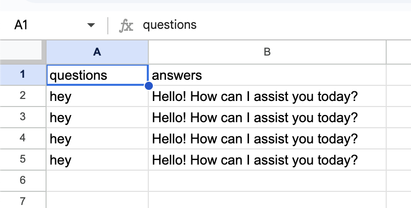
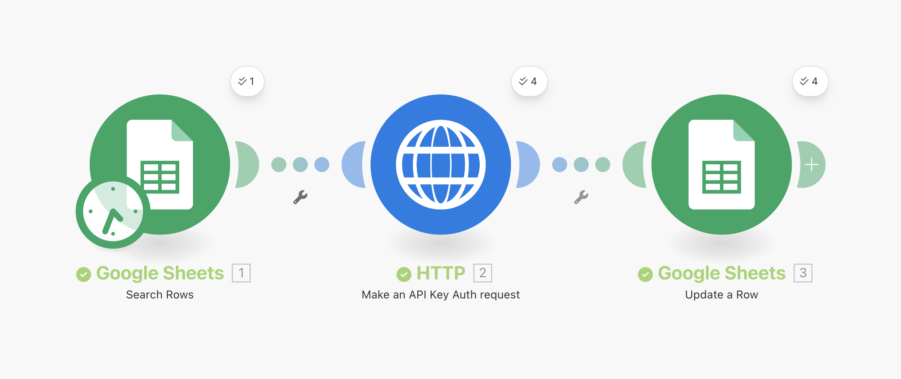

# CustomGPT n8n & Make.com Integration

Automate your workflows with CustomGPT's RAG (Retrieval-Augmented Generation) platform using n8n or Make.com. This integration enables you to connect CustomGPT with Google Sheets, webhooks, HTTP requests, and thousands of other services to create powerful automation workflows.

Get your [CustomGPT.ai RAG API key here](https://app.customgpt.ai/register?utm_source=github_integrations), needed to use this integration.




## Overview

This integration provides pre-built blueprints for connecting CustomGPT with popular automation platforms:

- **n8n**: Open-source workflow automation tool
- **Make.com** (formerly Integromat): Visual automation platform

### Use Cases

- **Automated Q&A**: Process questions from Google Sheets and populate answers automatically
- **Customer Support**: Route support tickets through CustomGPT for intelligent responses
- **Content Generation**: Batch process content requests with AI-powered responses
- **Data Processing**: Extract insights from large datasets using CustomGPT's knowledge base
- **Lead Qualification**: Automatically qualify and respond to leads based on your custom data
- **Knowledge Base Automation**: Keep documentation and FAQs up-to-date automatically

## Features

- **No-Code Integration**: Visual workflow builder with drag-and-drop interface
- **Multi-Step Workflows**: Chain multiple actions together
- **Google Sheets Integration**: Read questions, write answers, and manage data
- **HTTP Request Module**: Direct API calls to CustomGPT
- **Error Handling**: Built-in retry logic and error management
- **Scheduled Execution**: Run workflows on schedules or triggers
- **Real-time Processing**: Process data as it arrives
- **Batch Processing**: Handle multiple requests efficiently

## Prerequisites

- **CustomGPT Account**: [Sign up here](https://app.customgpt.ai/register?utm_source=github_integrations)
- **CustomGPT API Key**: Available in your CustomGPT dashboard
- **CustomGPT Agent ID**: The project/agent ID you want to use
- **Make.com Account** or **n8n Instance**: Choose your preferred automation platform
- **Google Account** (for Google Sheets integration)

## Quick Start Guide

### Option 1: Make.com Integration

#### Step 1: Import the Blueprint

1. Log in to your [Make.com account](https://www.make.com)
2. Click "Create a new scenario"
3. Click the three dots menu → "Import Blueprint"
4. Upload the [`Google Sheets-HTTP.blueprint.json`](./Google%20Sheets-HTTP.blueprint.json) file
5. Click "Save"

#### Step 2: Configure Google Sheets Connection

1. Click on the **Google Sheets** module (first module)
2. Click "Add" next to Connection
3. Sign in with your Google account
4. Grant necessary permissions
5. Select your spreadsheet and sheet:
   - **Spreadsheet**: Choose your spreadsheet
   - **Sheet Name**: Select the sheet (e.g., "Sheet1")
   - **Table Contains Headers**: Yes
   - **Column Range**: A1:CZ1 (adjust based on your needs)

#### Step 3: Configure CustomGPT API

1. Click on the **HTTP** module (second module)
2. Update the URL with your Agent ID:
   ```
   https://app.customgpt.ai/api/v1/projects/{YOUR_AGENT_ID}/chat/completions
   ```
   Replace `{YOUR_AGENT_ID}` with your actual CustomGPT Agent/Project ID

3. Click on "Authorization" header
4. Replace `CUSTOMGPT_API_KEY` with your actual API key:
   ```
   Bearer YOUR_ACTUAL_API_KEY
   ```

5. Configure the request body:
   ```json
   {
     "messages": [
       {
         "role": "user",
         "content": "{{1.`0`}}"
       }
     ],
     "model": "gpt-4-o",
     "stream": false,
     "lang": "en"
   }
   ```

#### Step 4: Configure Response Writing

1. Click on the **Google Sheets** module (third module - Update Row)
2. Verify the connection is set correctly
3. Map the response to the correct column:
   - **Row Number**: `{{1.__ROW_NUMBER__}}`
   - **Column**: Select "answers (B)" or your target column
   - **Value**: `{{2.data.choices[].message.content}}`

#### Step 5: Test the Workflow

1. Click "Run once" to test
2. Check your Google Sheet for results
3. If successful, click "Schedule" to enable automatic runs

### Option 2: n8n Integration

#### Step 1: Install n8n

**Cloud Version:**
- Sign up for [n8n Cloud](https://n8n.io/cloud)

**Self-Hosted:**
```bash
# Using npm
npm install n8n -g
n8n start

# Using Docker
docker run -it --rm \
  --name n8n \
  -p 5678:5678 \
  n8nio/n8n
```

#### Step 2: Create Workflow

1. Open n8n in your browser (http://localhost:5678)
2. Click "Add Workflow"
3. Add the following nodes:

**Node 1: Google Sheets Trigger/Reader**
- Search for "Google Sheets"
- Select "Google Sheets Trigger" or "Read" node
- Connect your Google account
- Configure:
  - Operation: "Read Rows" or "On Row Added"
  - Spreadsheet: Select your spreadsheet
  - Sheet: Select your sheet
  - Filters: Optional filters for rows

**Node 2: HTTP Request (CustomGPT API)**
- Search for "HTTP Request"
- Configure:
  - Method: POST
  - URL: `https://app.customgpt.ai/api/v1/projects/{YOUR_AGENT_ID}/chat/completions`
  - Authentication: Generic Credential Type
  - Headers:
    ```json
    {
      "Authorization": "Bearer YOUR_API_KEY",
      "Content-Type": "application/json"
    }
    ```
  - Body:
    ```json
    {
      "messages": [
        {
          "role": "user",
          "content": "{{ $json.questions }}"
        }
      ],
      "model": "gpt-4-o",
      "stream": false,
      "lang": "en"
    }
    ```

**Node 3: Google Sheets Writer**
- Add another "Google Sheets" node
- Configure:
  - Operation: "Update"
  - Spreadsheet: Same as before
  - Sheet: Same as before
  - Row Number: `{{ $node["Google Sheets"].json.__ROW_NUMBER__ }}`
  - Columns: Map the response to your target column

#### Step 3: Test and Activate

1. Click "Execute Workflow" to test
2. Check results in Google Sheets
3. Click "Active" to enable the workflow

## Configuration

### Google Sheets Setup

**Required Columns:**
- **Column A (questions)**: Your input questions/prompts
- **Column B (answers)**: Where CustomGPT responses will be written

**Optional Columns:**
- Additional metadata columns (C, D, E, etc.)
- Status tracking
- Timestamps
- User information

**Example Sheet Structure:**
| questions (A) | answers (B) | status (C) | timestamp (D) |
|---------------|-------------|------------|---------------|
| What is your return policy? | [AI Response] | processed | 2025-01-15 |
| How do I reset my password? | [AI Response] | processed | 2025-01-15 |

### CustomGPT API Configuration

**Available Models:**
- `gpt-4-o` (recommended)
- `gpt-4-turbo`
- `gpt-3.5-turbo`
- `claude-3-opus`
- `claude-3-sonnet`
- Custom fine-tuned models

**Optional Parameters:**
```json
{
  "messages": [...],
  "model": "gpt-4-o",
  "stream": false,
  "temperature": 0.7,
  "max_tokens": 1000,
  "lang": "en",
  "session_id": "unique-session-id",
  "metadata": {
    "user_id": "user-123",
    "source": "google-sheets"
  }
}
```

### Advanced Configuration

**Rate Limiting:**
- Add delays between API calls using Make.com's "Sleep" module or n8n's "Wait" node
- Implement batch processing for large datasets
- Use error handling to retry failed requests

**Filters:**
- Process only rows where Column B is empty
- Skip rows marked as "processed"
- Filter by date or other criteria

**Error Handling:**
- Configure error handlers in Make.com
- Use n8n's error workflow feature
- Log errors to separate sheet or database

## Workflow Examples

### Example 1: Customer Support Automation

```
Trigger: New row in Google Sheets
↓
HTTP Request: Send question to CustomGPT
↓
Update Row: Write answer back to sheet
↓
Send Email: Notify customer (optional)
```

### Example 2: Batch Content Generation

```
Schedule: Every hour
↓
Read Rows: Get unprocessed questions
↓
HTTP Request: Process each question through CustomGPT
↓
Update Rows: Write all answers back
↓
Slack Notification: Report completion (optional)
```

### Example 3: Lead Qualification

```
Webhook: New lead from form
↓
HTTP Request: Analyze lead with CustomGPT
↓
Router: Based on AI response
  ├─ High Priority → Send to sales team
  ├─ Medium Priority → Add to nurture campaign
  └─ Low Priority → Send automated email
```

## API Reference

### CustomGPT Chat Completions Endpoint

**Endpoint:**
```
POST https://app.customgpt.ai/api/v1/projects/{project_id}/chat/completions
```

**Headers:**
```
Authorization: Bearer YOUR_API_KEY
Content-Type: application/json
```

**Request Body:**
```json
{
  "messages": [
    {
      "role": "user",
      "content": "Your question here"
    }
  ],
  "model": "gpt-4-o",
  "stream": false,
  "lang": "en"
}
```

**Response:**
```json
{
  "id": "chatcmpl-...",
  "object": "chat.completion",
  "created": 1704067200,
  "model": "gpt-4-o",
  "choices": [
    {
      "index": 0,
      "message": {
        "role": "assistant",
        "content": "The answer to your question..."
      },
      "finish_reason": "stop"
    }
  ],
  "usage": {
    "prompt_tokens": 50,
    "completion_tokens": 150,
    "total_tokens": 200
  }
}
```

## Troubleshooting

### Common Issues

**1. Authentication Errors**
- Verify your API key is correct
- Ensure "Bearer " prefix is included in Authorization header
- Check API key permissions in CustomGPT dashboard

**2. Google Sheets Connection Issues**
- Re-authenticate with Google
- Check spreadsheet sharing permissions
- Verify sheet name is correct (case-sensitive)

**3. Empty Responses**
- Check your Agent ID is correct
- Verify your CustomGPT agent has content/data sources
- Check API request format matches documentation

**4. Rate Limiting**
- Add delays between requests
- Reduce batch size
- Check your CustomGPT plan limits

**5. Workflow Not Triggering**
- Verify trigger conditions are met
- Check workflow is activated
- Review execution logs

### Debug Mode

**Make.com:**
1. Click on any module
2. Click "Run this module only"
3. Check the output in the inspector panel

**n8n:**
1. Click "Execute Workflow"
2. View execution data in the node
3. Check browser console for errors

## Best Practices

### Performance Optimization

1. **Batch Processing**: Process multiple rows in chunks
2. **Conditional Logic**: Only process rows that need updating
3. **Caching**: Store frequently used responses
4. **Error Recovery**: Implement retry logic with exponential backoff

### Security

1. **API Key Protection**
   - Never commit API keys to version control
   - Use environment variables or credential storage
   - Rotate keys regularly

2. **Data Validation**
   - Sanitize inputs before sending to API
   - Validate response data before writing to sheets
   - Implement input length limits

3. **Access Control**
   - Restrict Google Sheets access appropriately
   - Use service accounts for production workflows
   - Implement audit logging

### Cost Management

1. **Monitor Usage**: Track API calls and token usage
2. **Optimize Prompts**: Keep prompts concise and clear
3. **Set Limits**: Implement daily/monthly usage caps
4. **Choose Right Model**: Use appropriate model for task complexity

## Additional Integrations

### Connecting Other Services

The blueprint can be extended to connect with:

- **Slack**: Send notifications or process messages
- **Email**: Gmail, Outlook, SendGrid integration
- **CRM**: Salesforce, HubSpot, Pipedrive
- **Databases**: MySQL, PostgreSQL, MongoDB
- **Webhooks**: Any webhook-enabled service
- **Storage**: Dropbox, Google Drive, AWS S3
- **Calendar**: Google Calendar, Outlook Calendar
- **Forms**: Typeform, Google Forms, Jotform

### Multi-Agent Workflows

Use different CustomGPT agents for different tasks:

```
Router Node
├─ Support Questions → Support Agent (ID: 123)
├─ Sales Inquiries → Sales Agent (ID: 456)
└─ Technical Issues → Tech Agent (ID: 789)
```

## Resources

### CustomGPT Resources
- **[CustomGPT Landing Page](https://customgpt.ai)**
- **[Live Demo](https://app.customgpt.ai/agents?demo=chat)**
- **[API Documentation](https://docs.customgpt.ai/api-reference)**
- **[Postman Collection](https://www.postman.com/customgpt/customgpt/overview)**
- **[CustomGPT Starter Kit](https://github.com/Poll-The-People/customgpt-starter-kit)**
- **[All Integrations](https://github.com/Poll-The-People/customgpt-integrations)**
- **[Office Hours](https://calendly.com/pollthepeople/office-hours)**
- **[YouTube Channel](https://www.youtube.com/channel/UC6HOk7Z9OwVPNYiC7SKMJ6g)**

### Platform Documentation
- **[Make.com Documentation](https://www.make.com/en/help)**
- **[n8n Documentation](https://docs.n8n.io)**
- **[Google Sheets API](https://developers.google.com/sheets/api)**

### Video Tutorials
- **[Make.com Tutorial](https://www.youtube.com/watch?v=...)** *(coming soon)*
- **[n8n Tutorial](https://www.youtube.com/watch?v=...)** *(coming soon)*

## Support

- **CustomGPT Issues**: Open an issue in the [customgpt-integrations repository](https://github.com/Poll-The-People/customgpt-integrations/issues)
- **Make.com Support**: [support.make.com](https://support.make.com)
- **n8n Support**: [community.n8n.io](https://community.n8n.io)

## Examples & Templates

Check out additional blueprint examples:
- Customer support automation
- Lead qualification workflow
- Content generation pipeline
- Data enrichment automation
- Multi-language translation
- Sentiment analysis workflow

## Contributing

Have improvements or additional blueprints to share? Contributions are welcome!

1. Fork the repository
2. Create your feature branch
3. Add your blueprint/workflow
4. Submit a pull request

## License

MIT License - see LICENSE file for details

