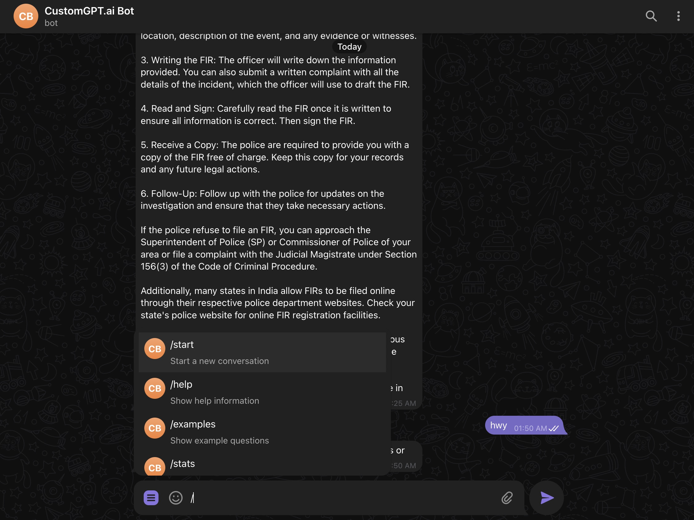

# Telegram Bot for CustomGPT

A Telegram bot that integrates with CustomGPT.ai to provide AI-powered responses using your custom knowledge base.



## Features

- 🤖 **AI-Powered Responses**: Uses CustomGPT.ai's API to answer questions from your knowledge base
- 💬 **Conversation Management**: Maintains context within chat sessions
- 🚦 **Rate Limiting**: Built-in daily (100) and per-minute (5) message limits
- 🎯 **Starter Questions**: Interactive buttons with example queries
- 📊 **Usage Statistics**: Track your daily usage with `/stats`
- 🔄 **Session Management**: 30-minute conversation timeout with auto-cleanup
- 🛡️ **Security**: SSL certificate handling and secure API communication

## Project Structure

```
telegram/
├── bot.py                 # Main bot implementation (polling mode)
├── customgpt_client.py    # CustomGPT API client
├── simple_cache.py        # In-memory rate limiting & session management
├── requirements.txt       # Python dependencies
├── .env                   # Environment variables (create your own)
├── README.md             # This file
├── vercel-bot/           # Vercel webhook deployment
│   ├── api/
│   │   └── webhook.py    # Webhook handler for Vercel
│   ├── vercel.json       # Vercel configuration
│   ├── set_webhook.py    # Webhook setup script
│   └── README.md         # Vercel-specific instructions
├── deploy-vercel.md      # Vercel deployment guide
└── deploy-replit.md      # Replit deployment guide
```

## Prerequisites

- Python 3.8+
- Telegram Bot Token (from [@BotFather](https://t.me/botfather))
- CustomGPT.ai API Key and Project ID
- SSL certificates (handled automatically with certifi)

## Installation

1. **Clone the repository**:
   ```bash
   cd telegram/
   ```

2. **Install dependencies**:
   ```bash
   pip install -r requirements.txt
   ```

3. **Set up environment variables**:
   Create a `.env` file:
   ```env
   TELEGRAM_BOT_TOKEN=your_bot_token_here
   CUSTOMGPT_API_KEY=your_api_key_here
   CUSTOMGPT_PROJECT_ID=your_project_id_here
   
   # Optional configuration
   DAILY_LIMIT=100
   MINUTE_LIMIT=5
   SESSION_TIMEOUT_MINUTES=30
   ```

## Running the Bot

### Local Development (Polling Mode)
```bash
python bot.py
```

This runs the bot in polling mode - perfect for development and testing.

## Bot Commands

- `/start` - Welcome message with example question buttons
- `/help` - Show available commands and tips
- `/examples` - Display example questions you can ask
- `/stats` - View your usage statistics
- `/clear` - Clear conversation history and start fresh

## Deployment Options

### 1. Vercel (Webhook Mode) - Free
Best for: Simple bots with quick responses

**Pros**:
- ✅ Completely free
- ✅ Auto-scaling
- ✅ HTTPS included
- ✅ Easy deployment

**Cons**:
- ❌ 10-second timeout limit
- ❌ No persistent storage
- ❌ Cold starts
- ❌ No rate limiting

See [`vercel-bot/README.md`](vercel-bot/README.md) for detailed instructions.

### 2. Replit (Polling Mode) - Free with limitations
Best for: Development and testing

**Pros**:
- ✅ Free tier available
- ✅ Persistent storage
- ✅ Web IDE
- ✅ Easy setup

**Cons**:
- ❌ Sleeps after inactivity
- ❌ Requires pinging to stay alive
- ❌ Limited resources

See [`deploy-replit.md`](deploy-replit.md) for instructions.

### 3. Railway (Polling/Webhook) - Paid
Best for: Production bots

**Pros**:
- ✅ No timeout limits
- ✅ Persistent storage options
- ✅ Better performance
- ✅ Supports both modes

**Cons**:
- ❌ Requires payment
- ❌ More complex setup

### 4. VPS/Cloud (Any Mode) - Varies
Best for: Full control

**Options**:
- AWS EC2 (free tier)
- Google Cloud (free tier)
- DigitalOcean ($5/month)
- Any Linux VPS

## Technical Details

### Rate Limiting
- **Daily Limit**: 100 messages per user
- **Minute Limit**: 5 messages per minute
- **Implementation**: In-memory cache (resets on restart)

### Session Management
- **Timeout**: 30 minutes of inactivity
- **Storage**: In-memory (non-persistent)
- **Cleanup**: Automatic for expired sessions

### API Integration
- **CustomGPT API**: RESTful API with streaming support
- **SSL Handling**: Uses certifi for certificate verification
- **Error Handling**: Graceful degradation with user-friendly messages

## Common Issues & Solutions

### SSL Certificate Error (macOS)
```python
# Already fixed in customgpt_client.py
import certifi
import ssl
ssl_context = ssl.create_default_context(cafile=certifi.where())
```

### Bot Not Responding
1. Check bot token is correct
2. Verify API credentials
3. Ensure bot is running (`python bot.py`)
4. Check network connectivity

### Rate Limit Exceeded
- Wait for the timeout period
- Daily limits reset at midnight
- Minute limits reset after 60 seconds

### Session Expired
- Use `/clear` to start a new conversation
- Sessions timeout after 30 minutes of inactivity

## Development Tips

### Testing Locally
1. Use polling mode for easier debugging
2. Set lower rate limits for testing
3. Use `/stats` to monitor usage

### Adding Features
- Extend `handle_message` in `bot.py` for new commands
- Modify `simple_cache.py` for persistence
- Update `customgpt_client.py` for API changes

### Debugging
```python
# Enable debug logging
import logging
logging.basicConfig(level=logging.DEBUG)
```

## Security Considerations

1. **Never commit `.env` file** - It contains sensitive credentials
2. **Use environment variables** for all secrets
3. **Implement user allowlisting** if needed:
   ```python
   ALLOWED_USERS = [123456789]  # Telegram user IDs
   ```
4. **Monitor usage** with `/stats` command
5. **Set appropriate rate limits** based on your needs

## Future Enhancements

- [ ] Persistent storage (PostgreSQL/Redis)
- [ ] User authentication
- [ ] Admin dashboard
- [ ] Multiple language support
- [ ] Voice message support
- [ ] Image analysis capabilities
- [ ] Webhook mode for main bot
- [ ] Docker containerization

## License

MIT

## Support

For issues:
1. Check the [Common Issues](#common-issues--solutions) section
2. Review logs for error messages
3. Ensure all prerequisites are met
4. Verify API credentials are correct

For CustomGPT API issues, refer to their documentation.
For Telegram Bot API issues, check [Telegram Bot Documentation](https://core.telegram.org/bots/api).